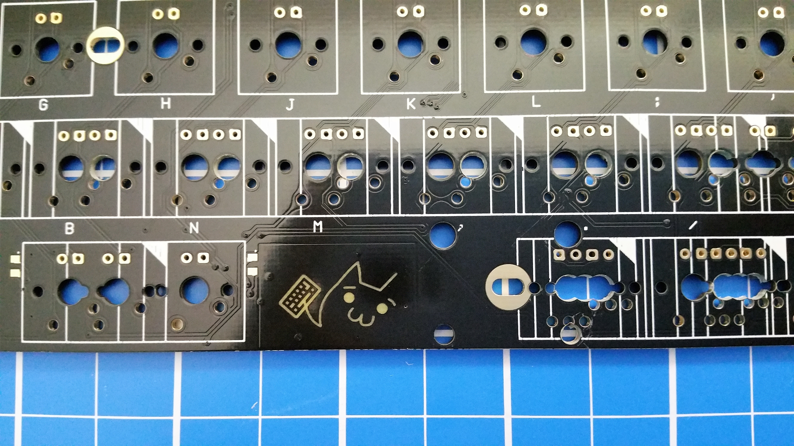
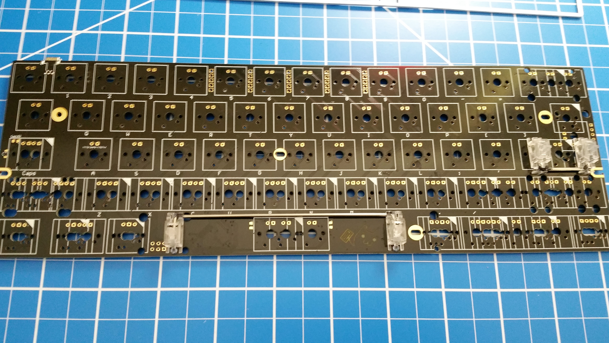
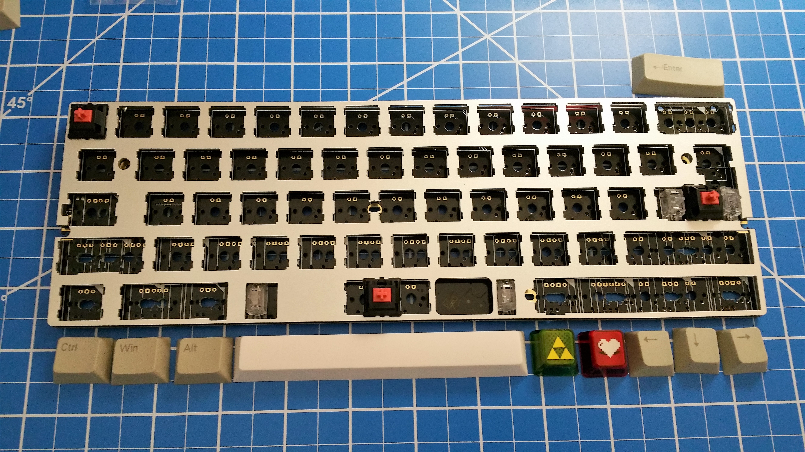
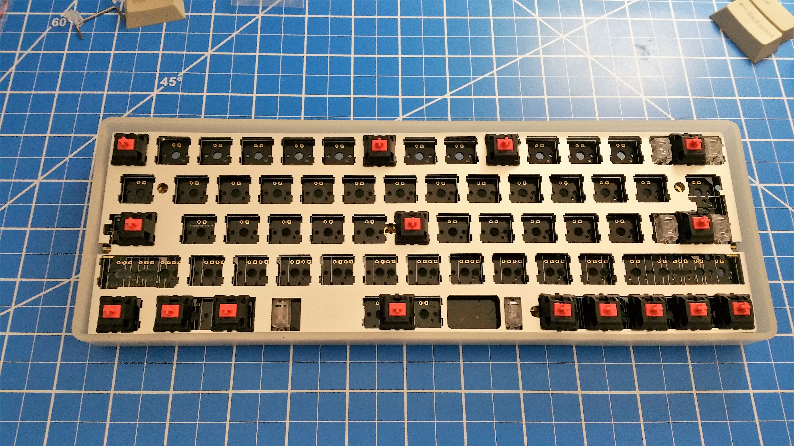
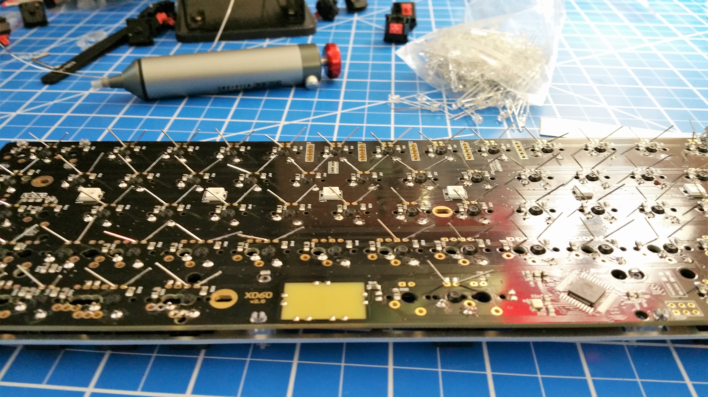
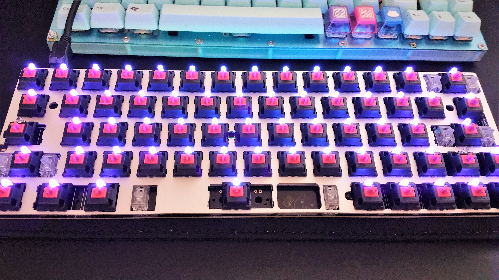
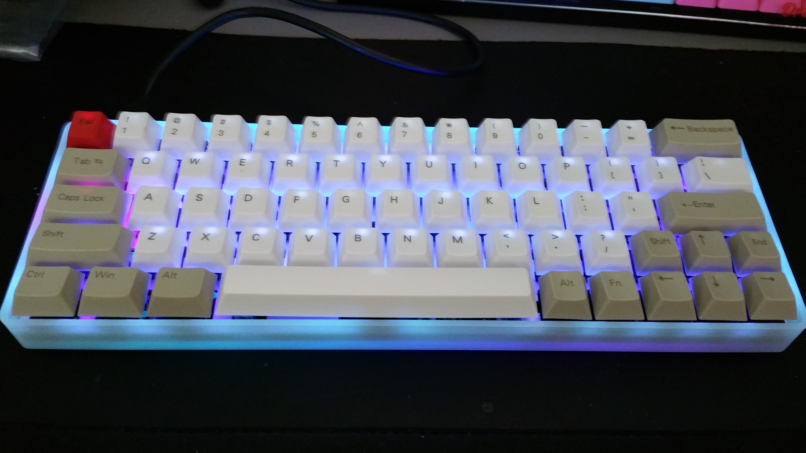

Building a Custom Mechanical Keyboard
=======
By David Lu

### Why?
As computer enthusiasts and professionals, we interact with our computers primarily through the  keyboard (and mouse). Few give this instrument much thought, but the average typist is easily capable of logging over 8,000 keystrokes every hour. How much do we type per year?

The average typist types about 40 wpm. Let's assume they do this for just 15 minutes per day 5 days a week. Let's also assume that the average word is 5 keystrokes and our average typist gets a 2 week vacation each year. 40 * 15 * 5 * 5 * 50 = 750,000 keystrokes a year! Most of us type far more than that. So it makes sense to pay a bit more attention to your keyboard.

Here's a custom one I built recently. I built rather than bought because I was looking for some specific features that generally cannot be found on models in the store. I was looking for a quiet, mechanically switched, reasonably lightweight, compact keyboard with a dedicated arrow cluster in a 60% case. Let's talk about the features of this board in a bit more detail.

### Details
You've likely heard about mechanical keyboards and their benefits. They are often marketed toward PC gamers. These are keyboards which contain individual mechanical switches and springs underneath each key. The typical OEM or office keyboard uses a rubber or silicone membrane under the keys with domes which, when collapsed, contacts and completes a circuit on the circuit board. The use of rubber domes results in mushy key presses and interference from dust and debris. Since there's so much written about the pros and cons of mechanical keyboards versus membrane keyboards on the internet, I won't rehash it here. I'm building a mechanical keyboard.

The Cherry MX Silent Red switches I picked for my build contain rubber nibs that dampen sound on both down and upstrokes. They actuate at 45cN of force (relatively light) linearly with no tactile feedback. There are a multitude of mechanical switch types. You can find switches with high actuation force, *clicky* switches, non-clicky switches with tactile feedback, and on and on. A benefit of building your own keyboard is that you can pick the exact switches that you like for each key. (They don't even have to all be the same switch! Some people prefer a much higher actuation force switch for the spacebar only; or to have one type of switch for the alphanumerics and another type for the modifiers and F keys. Customize to your heart's content.)

I want a very particular layout. Here's the typical 104 key ANSI layout we're familiar with:

 

While this layout offers access to a high number of raw keycodes without modifiers, it can be an inefficient use of desktop space. For instance, I don't need a number pad. The inclusion of a number pad takes up about 5u (1u is the width of a standard alphanumeric key) worth of space. This is space that my mouse could use. It is space that could be conserved when I move my hand from keyboard to mouse and back. All of the functionality of the number pad can be found in the rest of the keyboard.

Removing the dark grey number pad results in an 80% layout, otherwise known as tenkeyless or TKL. Mechanical off the shelf TKL keyboards are often advertised as compact, but I'd like something more compact. Most of the functions in the medium grey are ones that I don't use so often, and I would be fine accessing them through a combination key press with a modifier. The 60% layout is what I want.

There are, however, some difficulties with the 60% layout. With fewer keys, more functions need to be accessed via combination keystrokes with modifiers. Here's a fairly typical 60% layout with the function layer labeled. Notice it uses a vim-like *h, j, k, l* combined with *Fn* for the arrows.

I'm fine accessing arrows in vim due to its modal nature, but I just can't get used to accessing arrows while my pinky holds down the Fn key. I want a layout that includes a dedicated arrow cluster but doesn't relocate any of the punctuation keys and isn't any bigger than this 60% layout. Can it be done? Yes it can. In order to accommodate the arrow cluster at the bottom right, we'll need a slightly shorter 2u left shift, resulting in a shift of the entire *z* row slightly left, and a 1u right shift.

Here's my build log.
 

### Parts List
* XD 60/64 PCB compatible with 2u left shift layout
* 2u left shift layout aluminum plate
* Stabilizers for space, left and right shift, enter, and backspace
* 60% glow in the dark case
* 64 Cherry MX Silent Red mechanical switches
* 64 long-wave UV LEDs
* Dye-sub PBT keycaps with 2u and 1u shift
* Silicone O-rings for keycaps
* Crimp USB-A to USB-Micro kit

I purchased many of the parts from China!

### Tools
* Soldering iron
* 63/37 .032" solder
* Soldering wick and sucker
* Screwdriver
* Wire clipper

The Build
------
Here's the plate and PCB.

The plate is what holds the switches in place. This determines the layout of the keyboard. This particular plate has a slightly shorter than usual left shift, resulting in the entire *z* row shifted to the left slightly. This will allow placement of a dedicated arrow cluster on the bottom right.

The PCB contains the circuitry and microcontroller needed. It's also possible to hand-wire a keyboard if no PCB is compatible with the layout you desire. Notice this PCB is compatible with many layouts on the bottom two rows.

The first step to assembling a keyboard is to install stabilizers for the longer keys. We'll want to test fit them before you clip them in.

While we're at it, test fit the layout of the bottom row.

Once we're happy with the fit, we can begin soldering. The switches should be clipped into the plate with its two contacts fitting the PCB. When soldered the switches will be sandwiched between the PCB and the plate. Solder the corners first so that the sandwich is tight.

Notice that I'm missing a stabilizer on the left shift. This caused a great headache later on after many switches were soldered. Since the stabilizers are also sandwiched between the PCB and plate, removing or adding a stabilizer requires taking this sandwich apart, which means desoldering everything. I ended up solving this problem by using a hair dryer to desolder entire areas at once.

Once I was done with the switches, I decided to put in individual 3mm LEDs for each key. The circuitry is already supported by the PCB.

Here it is with switches and LEDs soldered.

Plug it in to test everything.

Now we'll install it into the case.

Next we'll place the keycaps on each switch.

And now we'e done assembling!

Since the PCB contains an Atmega32u4 8-bit microcontroller, it's fully programmable with its C compiler. I flashed the keyboard with the open source [QMK keyboard firmware](https://github.com/qmk/qmk_firmware) and it's ready to go.

-------

Lesson
=======

There are two lessons I hope you might learn from this blog post. Neither are about keyboards.

First: explore, modify, and build things that you're interested in and have a passion for. This is a great way to have fun and learn at the same time. Many programmers got their start programming by exploring, modifying, and creating video games.

Second: write up and document your projects. You should do this for your personal projects as well as your school projects. It doesn't have to be long or very detailed. It doesn't even have to be very good writing. The purpose is to reflect on what you've done and what went well and what went wrong.

-David
