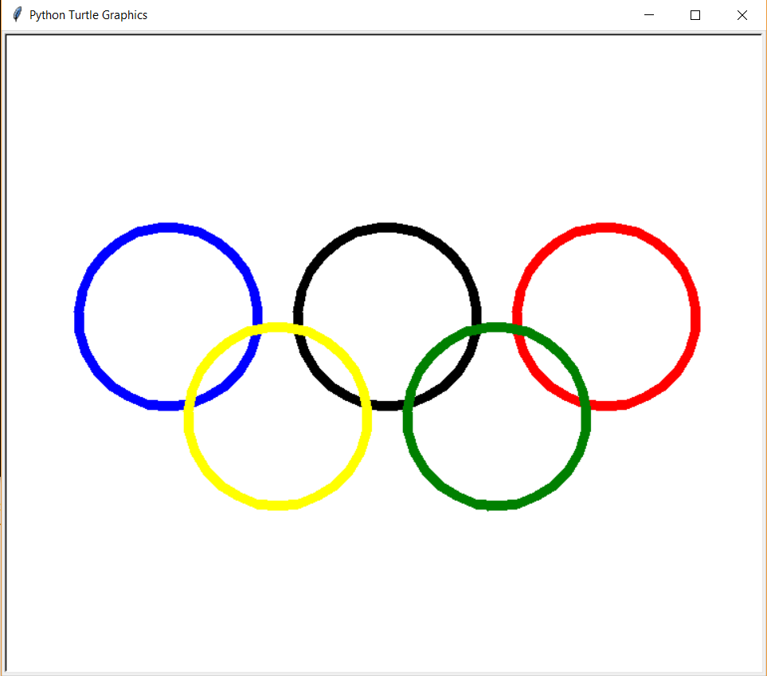
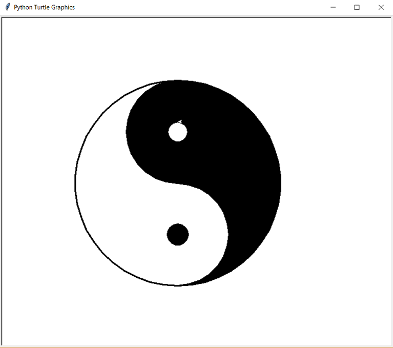
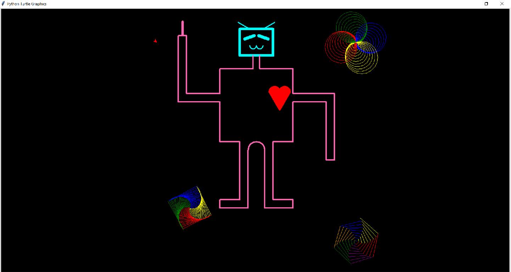
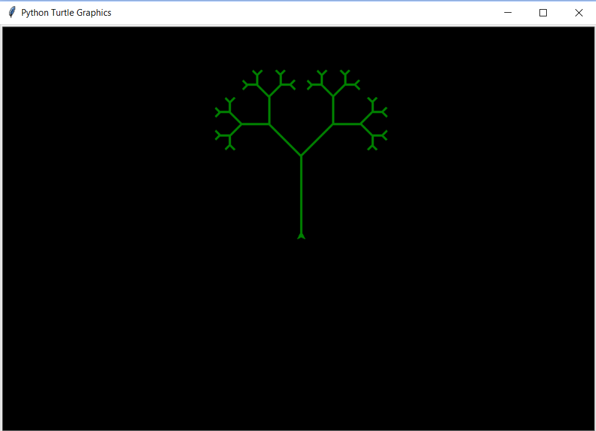
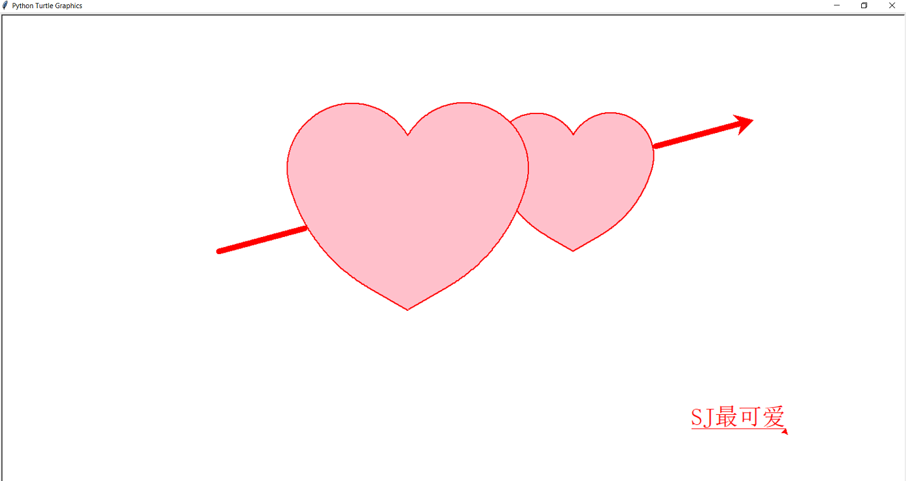

---
presentation:
  # The "normal" size of the presentation, aspect ratio will be preserved
  # when the presentation is scaled to fit different resolutions. Can be
  # specified using percentage units.
  width: 1280
  height: 820
  transition: 'slide'
---

<!-- slide data-transition="zoom"-->
## CS161 at CCUT: Student Showcase
### Fall 2017

David Lu

<!-- slide data-transition="convex" align="left"-->
### Challenges

One of the major challenges facing English language introductory programming instruction in China is getting students to actively participate an engage in hands-on coding. Students in China are habituated to passively listening to the instructor read lecture slides which rehash textbook material -- code snippets, contextless examples, abstract explanations, and forgettable definitions.

<!-- slide data-transition="convex" vertical=true align="left"-->

Specific hurdles include getting tooling installed on student laptops, instruction using the tooling, large class sizes, and lack of student interest and motivating projects.

<!-- slide data-transition="convex" align="left"-->
### Python and Turtle
CS161 at CCUT is an first-year introductory programming language course taught in C++. Students in this course generally have little to no previous programming experience.

I was able to gain permission this trip to teach Python for the 4 week session, in which a visiting instructor from PSU teaches a portion of the course in person in English. In particular, I focused lessons, examples, and projects around the turtle graphics library.

<!-- slide data-transition="convex" vertical=true align="left"-->

Python is a particularly good language of instruction for an introductory course.

* Tooling is easy to get set up and running. IDLE is a simple, lightweight, cross-platform IDE that is suitable for beginners.

* Python itself has an easy to read syntax with less visual clutter than C++, and uses English-based keywords.

<!-- slide data-transition="convex" vertical=true align="left"-->
The turtle graphics library allows drawing of vector graphics using a cursor, the "turtle," on a Cartesian plane. The concept of drawing graphics with the turtle is simple and intuitive, and it is an excellent tool for introducing the idea of imperative programming.

* The turtle has 3 properties: location, heading, and a pen.
* The pen has 3 properties: color, width, and on/off.
* Graphics are drawn by commands which set the turtle's properties and move it around the plane.
* Typical programming concepts -- variables, control structures, subroutines -- are used and students can visually see results of their work.

<!-- slide data-transition="zoom" align="left"-->
### In-class Group Project
Lectures are centered around discussing a new concept, seeing an example in action, and live coding demonstrations. Students are given access to the code for all examples and encouraged to explore and modify the code.

Toward the end of the session, students participated in an in-class group project, where they were to discuss, design, and implement a turtle graphics program in Python together.

Here are a few examples that were presented to the class.

<!-- slide data-transition="zoom" -->
One group decided to make use of the goto() and circle() functions to draw the Olympic Rings

<!-- slide data-transition="fade" -->

<!-- slide data-transition="zoom" -->
Another group used the goto() and circle() functions to draw a Yin and Yang symbol.

<!-- slide data-transition="fade" -->

<!-- slide data-transition="zoom" -->
One group used a series of heading changes and forward movements to draw a robot. They also took some of the examples from class and placed them around the robot.

<!-- slide data-transition="fade" -->

<!-- slide data-transition="zoom" -->
This group experimented with a recursive function!

<!-- slide data-transition="fade" -->

<!-- slide data-transition="zoom" -->
These students made use of a number of techniques we covered in class to draw a night scene on the water.

<!-- slide data-transition="fade" -->

<!-- slide data-transition="zoom" -->
And lastly, this group explored using subroutines to draw curves and made use of the turtle text writing function.

<!-- slide data-transition="fade" -->

<!-- slide -->
# END
