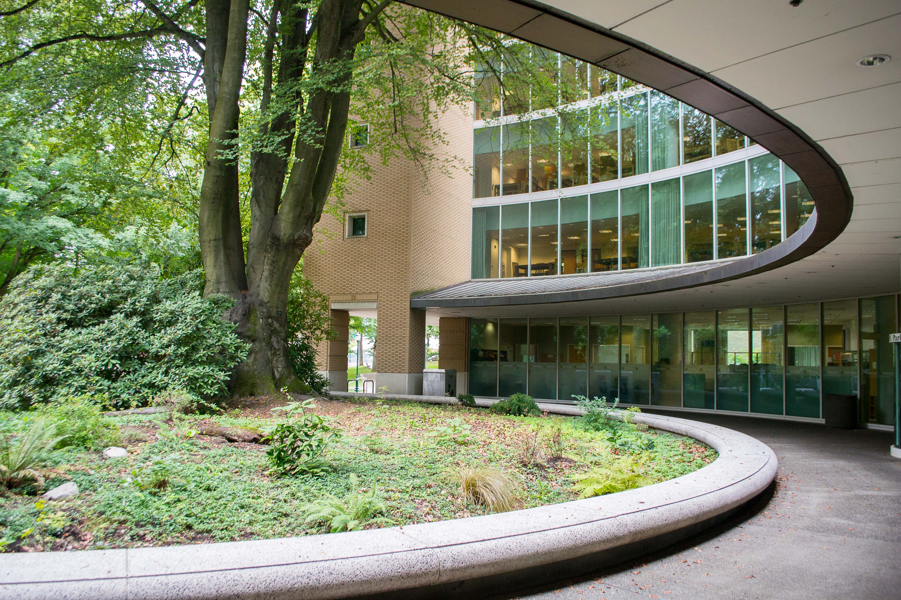

CS161 at CCUT Week 1: Introductions
======

Course Title: CS161 -- Introduction to Programming and Problem Solving

Instructor: David Lu

Some facts about me:
* Born and grew up in the US (mostly in New York, near New York city)
* Went to college at the [University at Buffalo](https://www.buffalo.edu/), which is located in upstate NY, near Canada.
* Graduated with a BA in Philosophy
* Worked on a PhD in Philosophy at [Syracuse University](https://www.syracuse.edu/) (also located in upstate NY - central), specializing in metaphysics and philosophical methodology
* Taught philosophy courses on ethics, metaphysics and epistemology, critical thinking, and formal logic at Syracuse University

Here are some pictures of SU:


The building housing the philosophy department:


* Now I teach discrete math, introduction to C++, and ethics for computing at Portland State University




* This is my 3rd year participating in the PSU--CCUT partnership program
* Oldest of three: one younger brother and one younger sister

### Course Purpose and Goals
The goal of CS161 is to introduce students to programming concepts and practices.

Computer programming is a crucial skill that everyone should be learning. We use computers to solve problems, play games, work more effectively, automate tasks, connect with people around the world, and many other examples.

Everyone can learn to program. It's somewhat like solving a puzzle. Learning to program is exciting if you're willing to try new things and to explore. Try taking some code and modifying it, seeing what happens with the resulting program. Even if it breaks, you'll learn something new by trying to fix it. Let's try running the following Python code.

```Python
import turtle   
colors=['red', 'purple', 'blue',
        'green', 'yellow', 'orange']
t=turtle.Pen()
turtle.bgcolor('grey')
for x in range(360):
    t.pencolor(colors[x%6])
    t.width(x/100+1)
    t.forward(x)        
    t.left(59)
```
Now let's change some of the values. What happens?

Experimenting with code is a great way to learn how programs work; it's even more fun if you work with a friend.

>Side note on programming languages:
In this course, you have been learning C++. In an introductory class, I prefer to teach Python. So I may show you some motivating examples in Python that are a bit too complicated to implement in C++ for beginners.

Computer programs -- also called *applications* or *apps* -- tell computers what to do. A web app can tell a computer how to keep track of the things you buy; a game app might tell a computer how to display a battlefield with players on it; and the simple app above tells the computer to draw a colorful spiral. Apps can be thousands or millions of lines of code, or they can be just a few lines of code like above.

To begin programming, we have to speak a language the computer understands. Computers need step-by-step instructions, and they can only understand certain languages like the Python above or the C++ you will learn this year.

Bring you computers to class so you can experiment with code too!

-----------------
