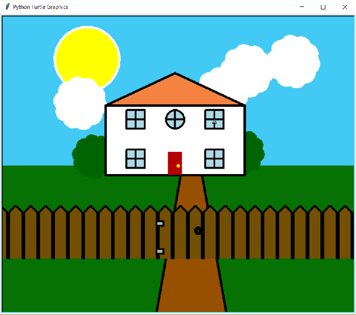

#CS161 at CCUT Week 2: In-Class Group Exercise



Before we leave Python and the turtle library and look toward C++, everyone should have some practice designing a program, programming, and seeing the results of their own program.

>Exercise:
Form a small group. Your task is to discuss with your group, design, and write a turtle program that draws a picture. It cannot be something I've shown you. You are limited to the types of statements below.
**Be ready to show the rest of the class what your program does.**

Programming is a creative exercise. It's good practice to explore and modify someone else's program, but you should also be able to create your own program. Try to think of something new. *Don't just copy or memorize other people's code.*

Open IDLE and click on `file` to bring the drop down menu and click `new file`. This will open a text editor in which you can write your program.

Your program should contain the following 5 lines of code:

```py
import turtle
t = turtle.Turtle()
turtle.bgcolor("#FFFFFF")
t.color("#000000")

#---> Your code here <---

turtle.exitonclick()
```

Recall that the first line allows you to use the functions in the Turtle library. The second line assigns the variable `t` to be a turtle. The third line sets the background color to white. The fourth line sets the color that the turtle draws. `#000000` is `black`. The last line keeps your drawing open after it is done until you click the screen.

Remember that color codes begin with `#` and use a six digit hexadecimal number, the first two indicating the saturation of red, the next two green, and the last two blue. So very red will be `#FF0000`. You can also use some English color names such as `white`, `black`, `red`, `purple`, `yellow`, `green`, `blue`, and so on. You should experiment with colors and color codes.

Below you will find a list of statements patterns that you are allowed to use. You will generally need to first assign values to the variables before you can use the statements. Or you can replace the variables directly with numbers.

* `t.forward(x)`

Moves the turtle foward `x` pixels in the direction it's facing.

* `t.right(x)`

Turns the turtle `x` degrees right.

* `t.left(x)`

Turns the turtle `x` degrees left.

* `t.width(x)`

Sets the width of the drawn line to `x` pixels.

* `t.color(x)`

Sets the color of the drawn line to `x`. `x` must be a color code or a color string.

* `t.fillcolor(x)`
  `t.begin_fill()`

  ``---> Your code here <---``

  `t.end_fill()`

Sets the fill color and fills in a shape that's drawn between the begin_fill() and end_fill() statements with that color.

* `t.penup()`

Turtle will not draw when it moves until pendown() statement is executed.

* `t.pendown()`

Turtle will draw a line when it moves. This happens by default.

* `t.goto(x,y)`

Turtle will jump to the coordinates `(x, y)` without drawing.

* For loops:
```
>for i in range(x):
[tab]>Your code here <---
[tab]>More code in the loop <---
>Code outside of the loop <---
```

Be sure to indent with a tab for the code you want inside the loop. This will execute the statements inside the loop `x` times with `i` starting at `0` and incrementing to `x-1`. `x` can be a number, but `i` must be a variable.

* `colors=["red","green","purple"]`

Creates a list of colors. You can have more than these three. The statement `colors[0]` accesses the first item of the list, in this case `"red"`. You can use this in conjunction with `t.color(colors[i%3])` to cycle through the colors in the list each time through a loop.

* Arithmetic expressions:

You may use any arithmetic expressions you'd like, such as `x = y/z`.
