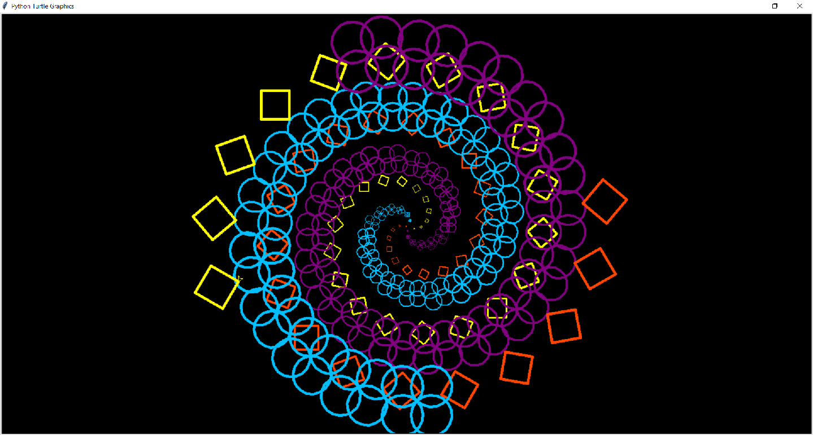

---
presentation:
  # The "normal" size of the presentation, aspect ratio will be preserved
  # when the presentation is scaled to fit different resolutions. Can be
  # specified using percentage units.
  width: 1280
  height: 740
  transition: 'slide'
---

<!-- slide data-background-video="../Portlandia.mp4" -->

<!-- slide -->
# CS161 at CCUT Week 4:

## [Control Structures ]
### If... else...
### Nested loops

And more turtle!

<!-- slide -->
Let's take stock of what we've looked at so far.

* Turtle library
  * Moving forward and backward
  * Turning left and right
  * Background and pen colors
  * penup() and pendown()
  * Color fill
  * goto(x, y)
  * Online documentation (https://docs.python.org/)

<!-- slide -->
General programming ideas:

* `For` loops
* Variables
* `input()`/`print()`
* Mathematical expressions
* Functions
* Comments

<!-- slide -->
Last week we were looking at this function and deciding whether it was (1) correct and (2) efficient :

```py
def isEven(value):
  numbers = list(range(0, 100)) # List all the numbers from 0, 99)
  odd = False

  for num in range(0, 100): # Remove every other number starting with the second one.
    if odd:
      numbers.remove(num)
    odd = not odd

  if value in numbers: # Check to see if the number is still in the list.
    return True
  else:
    return False
```
And perhaps antoher question to ask is: (3) is it easy to understand?

<!-- slide -->
One of your classmates suggested we use the modulo operator `%` for a better solution.

```py
def isEven(value):
    if value % 2 == 0:
        return True
    else:
        return False
```
We use the `==` operator to compare values.

Is it correct, efficient, and easy to understand?

Let's try it in IDLE!

<!-- slide -->
Here we see a new structure we haven't discussed yet: the **conditional statement**.

<!-- slide -->
So far, our turtle programs, when run, execute *every* statement beginning from the top to the bottom, sometimes with a loop over a block of statements.

<!-- slide -->
### Conditional Statement
The `if` keyword allows the program we write to make a decision whether to execute some statement or not during runtime.

Syntax:
```py
if {boolean expression}:
  (1) Some statement
  (2) Another statement in the block
(3) A statement outside of the block
```

If the boolean expression is `true`, statements (1), (2), and (3) are executed. If `false`, only (3) is executed.

<!-- slide -->
#### If... Else...

We can also specify some alterative behavior if the boolean expression is false:

```py
if {boolean expression}:
  Some statements
else:
  Some alternate behavior
```

<!-- slide -->
Before we make use of the conditional structure in a turtle program, let's discuss one more idea:

### **Nested Loops**

<!-- slide -->
A *nested loop* is a loop within another loop.

<!-- slide -->
Try this in IDLE

```py
for i in range(0, 3):
  for j in range(0, 5):
    print("i=", i, "j=", j)
```
What do you expect will happen?

<!-- slide -->
```py
for i in range(0, 3):
  for j in range(0, 5):
    print("i=", i, "j=", j)
```
Notice that the second `for` statement is inside the block of the first `for` statement.

<!-- slide -->
## Putting it together in turtle


<!-- slide -->
Recall an earlier program we looked at: [PolygonSides.py](PolygonSides.py)

```py
import turtle

shape = turtle.Turtle()

num_sides = int(input("How many sides do you want on your shape?"))

#num_sides = 6  						# We don't need this line anymore!
side_length = 200/ (num_sides * .5)		# What does this do?
pen_width = 3
color = 'orange'
angle = 360.0 / num_sides

for i in range(num_sides):
    shape.width(pen_width)
    shape.color(color)
    shape.forward(side_length)
    shape.right(angle)

turtle.exitonclick()
```

This program asked the user to specify the number of sides they wanted for their regular polygon.

<!-- slide -->
Suppose instead of a "side" drawn on each side of a polygon, we want to draw a polygon on each side. How do we modify our code to make it do that?

<!-- slide -->
The basic idea is that we can use nested loops to achieve the desired effect. We can modify our loop to include another loop. The **outer** loop moves the turtle to each "side" while the **inner** loop draws the polygons at each "side." Let's try it.
```py
for i in range(num_sides):
    shape.right(angle)
    shape.forward(side_length)
    for j in range(num_sides):
        shape.width(pen_width)
        shape.color(color)
        shape.forward(side_length)
        shape.right(angle)
```

<!-- slide -->
Here's the code with that modification: [Polygons with nested loop](NestedLoopPolygons.py)

```py
import turtle

shape = turtle.Turtle()

num_sides = int(turtle.numinput("Number of Sides", "How many polygons do you want?", 4))

#num_sides = 6  						# We don't need this line anymore!
side_length = 200/ (num_sides * .5)		# What does this do?
pen_width = 3
color = 'orange'
angle = 360.0 / num_sides

for i in range(num_sides):
    shape.right(angle)
    shape.forward(side_length)
    for j in range(num_sides):
        shape.width(pen_width)
        shape.color(color)
        shape.forward(side_length)
        shape.right(angle)

turtle.exitonclick()
```

Let's run it and see what happens!

<!-- slide -->
What if we don't want a polygon on every side? Instead, let's draw a rosette on each *even* side.

<!-- slide -->
A rosette is a small decoration, usually circular in shape or with circular patterns. I gave you an example earlier that drew a rosette: [Circles.py](Circles.py)

<!-- slide -->
## Putting it all together:
### [Rosettes and Polygons](RosettesAndPolygons.py)

<!-- slide -->
```python
import turtle
t = turtle.Pen()
turtle.bgcolor("black")
t.speed(40)          # Set turtle drawing speed

colors=['deep sky blue', 'orange red', 'purple', 'yellow', 'cyan', 'green',
        'deep pink', 'navy', 'lavender', 'aquamarine', 'pink', 'gold']
sides = int(turtle.numinput("Number of sides", "How many spiral sides?", 4, 1, 12))

for m in range(0, 120):
    t.pencolor(colors[m % sides])
    t.left(360/sides + 20/sides)
    t.width(m//25+1)        # // is floor division
    t.penup()
    t.forward(m*20/(1.2*sides)) # Scale for number of sides
    t.pendown()
    if (m % 2 == 0):     # Draw a rosette at each even corner
        for n in range(sides):
            t.circle(m/3)
            t.right(360/sides)
    else:                # Draw a polygon at each odd corner
        for n in range(sides):
            t.forward(m/2)
            t.right(360/sides)

turtle.exitonclick()
```

<!-- slide data-background-video="../Duke.mp4" data-background-video-loop=true -->
<div style="color:#5AFF0A"> I look forward to seeing all of you next spring!!</div>
