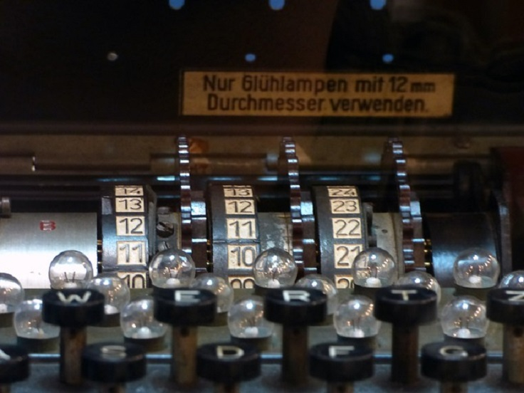

CS162: Homework #2 - Cipher
=======

From David Lu's Winter CS162 course.

Cipher Program
--------

>The  purpose  of  the  second  program  is  to  continue  refining  our  programming skills in C++ and practice using arrays of characters, the subscript operator, the `cstring`  library,  and functions  with  arguments.  Our  goal  is  to  create  programs where  `main()` delegates to  a  series  of small functions  that do the real  work.
>
>In  this  programming  assignment,  you  are **not** allowed  to use  global  variables. Avoid  using  break (unless  working  with  a  switch  statement). Limit  your functions to  less than 30 statements of code  (not  including comments, blank  lines,  or  variable  definitions). You may not  use  a  `return`  in  the middle of a loop!

#### Program Assignment: 

Every  term,  we  use  a  program  to  take  students  PSU  ID  numbers  and  convert them  into  barcodes  that  get  distributed  in  lab.  But,  there  is  a  step  between  that which converts the student’s ID number into a format that  can  be  used,  hiding information  within a  set  of  numbers.  It  got  us  thinking  about  the  information that  is  hidden  in  a  barcode  or  a  magnetic  strip.  We  can  hide  lots  of  information by encoding or building what is called a cipher. A cipher is just an algorithm for encoding  some  information so  that  people  can’t immediately tell what it is, without decoding it. With  your  second  program, we  will  create a  program  that  will  take your name and  email  address,  and  through  a  cipher  that  you  will  be  building,  output  the encoded results. Then upon the user’s request, it will decode the information  to double check that the process actually works
