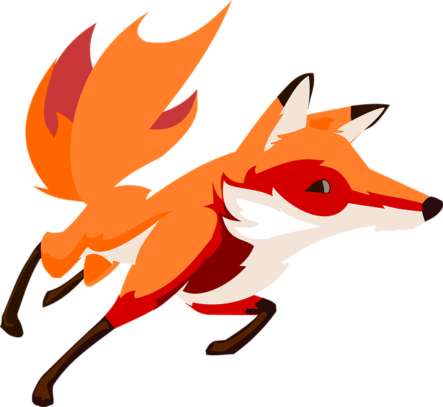

CS201: Homework \#1 - Typing Speed Game
========



Typing Speed Game
-----
Adapted from Professor Harry Porter's Fall 2015 CS201 course: [External link](http://web.cecs.pdx.edu/~harry/cs201/HW1.pdf)

>Implement a game that tests the player's typing speed in the C programming language. The game randomly chooses words from an array of null-terminated strings containing "The, "quick", "brown", "fox", "jumps", "over", "the", "lazy", "dog". Each word must appear exactly once during a game round. If the user incorrectly types a word, the program should prompt the user to retype the incorrect word.

>At the end of each game round, the program should display the total amount of time it took the user to complete the round and how many  mistakes they made.

<br>
### Details and Requirements:

Random permutations of words should be generated via calls to `srand()` and `rand()`.

Each permutation of the words must be possible.

Ensure that your random permutation is generated using a minimal number of `rand()` calls.

Timing should begin when the random permutation is first given to the user.

Timing should end when the user correctly inputs the permutation correctly.

##### Specific to Linux:
>At PSU, this assignment is to be implemented and run on the department's linux system. So there are some additional requirements.

Consult the linux man pages for more information on `rand()`, `/srand()`, `gettimeofday()`, `timersub()`, `printf()/scanf()`, `strlen()`, `strncmp()` etc.

Seed `srand()` using the `usec` field from a call to `gettimeofday()`

Use timer macro `timersub()` for handling operations on struct timevals
`(/usr/include/sys/time.h)`.

<br>
### Example Execution:

```
% ./typing_speed_game
This is a game that tests typing speed
Type the following words:
 word #1 is fox: foxy
Incorrect. Try again.
 word #1 is fox: fo
Incorrect. Try again.
 word #1 is fox: fox
 word #2 is The: The
 word #3 is brown: brown
 word #4 is lazy: lazy
 word #5 is jumped: jumped
 word #6 is over: over
 word #7 is quick: quick
 word #8 is dog: dog
 word #9 is the: the

Result:
Your time is: 15.24s
You made 2 mistakes.
%
```
