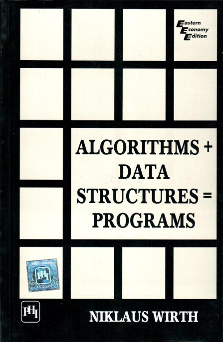

CS163 at CCUT Week 2: Linear Linked Lists
============
David Lu
4/22/17


## Data Structures
In computer science, a data structure is a particular way of organizing data in a computer so that it can be used efficiently.

Over the next few weeks, we will look at the some basic data structures: the linear linked list and the binary search tree.

  Topics to cover: <a id="index"></a>
  * [Introduction](#intro)
    * [Run Time Complexity](#bigO)
  * [Lists](#list)
    * [Linear Linked Lists](#LLL)
      * [Compare to arrays](#arrays)
      * [Complexity](#complexity)
      * [Basic operations:](#ops)
        * [Insert](#insert)
        * [Delete](#delete)
      * [Traversal](traverse)
      * [Recursion](#recursion)
      * [Searching](#search)
      * [Sorting (if we have time)](#sort)
  * [Practice Programming!](#practice)
  * [Practice Exercises](#exercises)

## Introduction <a id="intro"></a>
In 1976 Swiss computer scientist Niklaus Wirth (chief designer of the programming language Pascal) wrote an influential book titled *Algorithms + Data Structures = Programs*.



Algorithms and data structures are two fundamental topics in programming and they are closely related. We cannot learn about one without the other.

#### Run Time Complexity <a id="bigO"></a>
Any time we discuss and algorithm, we should also discuss its run time complexity. Generally we want to choose the most efficient algorithm.

*Big O* is a special notation that allows us to express how quickly an algorithm grows.

Imagine we are writing a search algorithm to help a drone calculate where to land. Suppose we are trying to decide between a simple search and a binary search. The algorithm needs to be both correct and fast. Perhaps we only have 10 seconds to figure out where to land, otherwise the drone will be off course.

On one hand, binary search is faster. We know this. On the other hand, simple search is easier to write and there is less chance of bugs. How might we decide whether it's okay to go with simple search?

We might time both methods and see how they differ. So suppose we time both algorithms with a list of 100 elements. Assume it takes 1 millisecond to check one element. With simple search, we must check 100 elements in the worst case, so the search takes 100ms in the worst case. On the other hand, binary search only has to check 7 elements (log_2 100 is about 7), so the search takes 7ms.

More realistically, the search space might have a billion elements (1,000,000,000). How long will simple search take? And how long will binary search take?

Binary search on a billion elements takes about 32ms. (What's log_2 1,000,000,000?) How long do you think simple search will take?

Elements | Simple cearch | Binary search
:--|:-- |:--
100 | 100ms | 7ms
10,000 | 10 seconds | 14ms
1,000,000,000 | 11 days | 32ms

As the size of the search space increases, the time it takes simple search increases faster than binary search!

Algorithm efficiency is not measured in terms of seconds. Algorithm efficiency is measured in terms of growth.

-------

## Lists  <a id="list"></a>
In computer science, a list or sequence is an abstract data type that represents a **countable** number of **ordered** values, where the same value may occur more than once.

An _instance_ of a list is a computer representation of the mathematical concept of a finite sequence.

A list can also be defined inductively:
> A list is either empty or it is an item followed by a list.
-----------------------

## Linear Linked List <a id="LLL"></a>
In computer science, a linked list is a linear collection of data elements, called _nodes_, each pointing to the next node by means of a pointer.

It is a data structure consisting of a group of nodes which together represent a sequence.

In a simple linear linked list, each node is composed of a piece of data and a reference (in other words, a link) to the next node in the sequence.


Linked Lists are among the simplest and most common data structures because it allows for efficient insertion or removal of elements from any position in the sequence.

[Back to Index](#index)

----------------------
#### Compare to Arrays <a id="arrays"></a>
It is important to understand that a linked list is different than an array. Linked lists are not indexed and does not support arbitrary access.

Do you recall what an array is and how arrays work?

What are the benefits of arrays versus linked lists?

What are the benefits of linked lists versus arrays?

---------------------
### Time Complexity <a id="complexity"></a>

Time complexity for Linear Linked List:
|Access |Search |Insert |Delete|
|:-- |:-- |:-- |:-- |
|$\mathcal{O}(n)$ |$\mathcal{O}(n)$ |$\mathcal{O}(1)$ |$\mathcal{O}(1)$ |

--------------------
### Basic Operations <a id="ops"></a>
Abstract Data Type (ADT)

  * A constructor for creating an empty list
  * A test to see if a list is empty
  * A way to insert an item in front of the list
  * A way to insert an item at the back of the list
  * Search for a particular item
  * What else?

##### Code Basics
To implement a linear linked list in C\++, we need to understand a few C\++ concepts.

We can use a struct or a class to define each node inductively.

``` C++
  struct node
  {
    int data;
    node* next;
  };
```
[Back to Index](#index)

------------------------------
### Insertion <a id="insert"></a>
Let's keep things simple and consider linear linked lists of integers.

A basic operation for lists is to put something on the list. If our list is written on paper, we just find a place to write our item down. If our list is in markdown, we can do this:
  1. First item
  2. Second item

What is the algorithm for insertion in a linear linked list?

```python
  def insert(head, data):
    if head is empty:
      head <- data
    else:
      insert(head.next, data)
```

What will this do?

#### Insertion location
Should we insert at the front, back, or middle of the list?

What are the algorithms to do these?


#### Deletion <a id="delete"></a>
Another basic operation is to remove something from the list. Remember in C++ we need to free the memory that we allocated.

[Back to Index](#index)

-------------------
### Traversal <a id="traverse"></a>
You should have seen how to traverse the linear linked list by looping. Perhaps you've seen code that looks like this:

```c++
  node* temp = head;
  while(temp != NULL)
  {
    //Do stuff
    temp = temp->next;
  }
```

### Recursion <a id="recursion"></a>
Since a list is a recursive data type, it makes sense to make use of recursion in programming operations on lists.

Recursion is a tool a programmer can use to invoke a function call on itself.

Recursive programming is directly related to mathematical induction.
In recursive programming we need two things:
  * **A base case**
  * **A recursive case**

Consider the pseudocode to add an item at the end of a linear linked list.

*Iteratively*

  ```python
    def addLast(item):
      if head = None:
        head <- new node(item)
      else:
        node temp <- head
        while temp.next != None:
          temp <- temp.next
        temp.next <- new node(item)
  ```

  *Recursively*
  ```python
    def addLast(head, item):
      if head = None:
        head <- new node(item)
      else
        addLast(head->next, item)
  ```

Let's try in C++ together.

[Back to Index](#index)


--------------------------------
### Searching <a id="search"></a>
An operation we may be interested in doing on lists is to find whether an item is in a list or not. This is called *search*.

[Back to Index](#index)

-------------------------------------
### Sorting <a id="sort"></a>
Another operation we may be interested in performing on lists is to sort it. We called this *sort*.

[Back to Index](#index)
<br>


Practice Programming <a id="practice"></a>
========================
If you want to learn how to program, you must practice. Programming is a skill, not something that can just be memorized. Like any skill, you must practice to get good.

There are many websites that have environments set up so that you can practice programming.

Here are two examples that you can try:
[Codefights](https://www.pdx.edu/cecs/changchun-partnership-22-programs)
[HackerRank](https://www.hackerrank.com/)


Populating a random list to practice with in C++
------

Alternatively, you can program from scratch and practice.

There are some useful functions in the C++ standard library to generate random numbers.
We will need to include two libraries: ctime and cstdlib.

We need the ctime library to "seed" the peudo random number generator. The cstdlib library contains a pseudo random number generator function.

```C++
  #include <ctime>
  #include <cstdlib>

  ...

  // To seed the PRNG:
  srand(time(NULL)); // Do this only once!

  // To get a random number from 0 to 100:
  int num = rand() % 101;
```

So we may have a loop to insert some number of random numbers into our list to practice with.
For example:

```c++
  for(int i = 0; i < 10; ++i)
  {
    list.insert(rand() % 101);
    // Or insert(head, rand() % 101); if we do not have a class.
  }
```

[Back to Index](#index)


Practice with Linear Linked Lists <a id="exercises"></a>
-------

#### Print a list in reverse

  >Given a linear linked list $a$ print $a$ in reverse order.
  >
  >Example: $a$ = 3->2->4->5
  >Output of print($a$): 5->4->2->3

#### Compare two Lists

  >Given two linear linked lists $a$ and $b$, return true if they are the same list. (Order and values matter)

#### Reverse a linear linked list

  >Given a linear linked list $a$ return $a$ with its items in reverse order

#### Sorted copy

  >Given a linear linked list $a$, return a sorted list $s$ such taht $s$ contains the same values as $a$
  >
  >Example: Given 4->9->2->3->2, return 2->2->3->4->9
#### Delete duplicate

  >Given a sorted linear linked list, delete duplicates from the list.
  >
  >For example, if given 1->2->2->3->3->3->4, the resulting list should be 1->2->3->4.

#### Merge two sorted linear linked lists

  >Given sorted linear linked lists $a$ and $b$, return a sorted linear linked list $c$ that contains all elements from $a$ and $b$
  >
  >Example: $a$ = 2->3->4->6, $b$ = 1->3->7
  >$c$ = 1->2->3->3->4->6->7


[Back to Top](#index)
