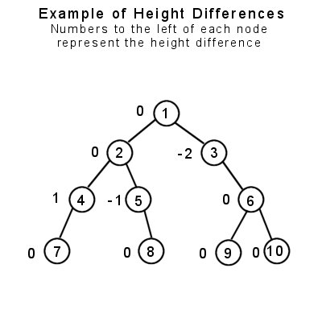

CS163 at CCUT Week 4: Final Week!
======
David Lu
5/5/17


Contents <a id="Index"></a>
--------
* [Last Week's Exercises](#LastWeek)
* [Binary Search Trees](#BST)


Last Week <a id="LastWeek"></a>
-----
Last week we implemented a number of linear linked list functions together. For instance here is our sortedInsert function:

```c++
void sortedInsert(node *&head, int data)
{   // Pass head by reference because head might change
    if(!head)             // Base case
    {
        head = new node;
        head->data = data;
        head->next = NULL;
    }
    else
    {
        node * temp = new node;
        temp->data = data;
        if(data < head->data)
        {
            temp->next = head;
            head = temp;
        }
        else              // Recursive case
            sortedInsert(head->next, data);
    }
}
```

#### An Error in Our Code!
We ended class before we could finish debugging the code for a function which takes a linear linked list and an int $n$, and deletes all occurrences of $n$ from the list recursively. Here is that code. Try to find our mistake and correct it! Think about whether we want a bool return. Think about what we need to do with our recursive call.

```c++
bool deleteAllN(node *&head, int N)
{
    if(!head)
        return false;
    else
    {
        if(N == head->data)
        {
            node * temp = head->next;
            delete head;
            head = NULL;
            head = temp;
        }
        deleteAllN(head->next, N);
    }
    return true;
}
```

[Return to top](#Index)

Binary Search Trees <a id="BST"></a>
=======
A binary tree is a recursively-defined tree that can have a maximum of two children. The two children are by convention called *left child* and *right child*. Nodes that do not have any children are called *leaves*. Binary trees are used for many things, ranging from efficient searching techniques, data compression, and expression parsers (simple compilers).

Since binary tree nodes can only have a maximum of two children, this introduces several properties that we care about. There are two important properties that a binary tree can have: **fullness** and **balance**.

Binary search tree have an additional property called the **binary search tree property**.

#### Fullness

A binary tree is considered full if every node in the tree has either two or zero children (a leaf) and every leaf is on the lowest level of the tree.


#### Balance

A binary tree can be *balanced*, such that one branch of the tree is about the same size and depth as the other. In order to find out if a tree node is balanced, you need to find out the maximum height level of both children in each node, and if they differ by no more than one level, it is considered balanced.

An easy way to determine balance by a recursive function to find the maximum depth of the left child, find the maximum depth of the right child, then subtract the two. If the number is –1, 0, or 1, the node is balanced. If the difference is anything else, then it is unbalanced. A balanced binary tree requires every node in the tree to have the balanced property.

>Test yourself! Write a function that determines whether a binary tree is balanced.



In this example, the only node which is unbalanced is node \#3, because the depth of its left side is 0, and the depth of the right side is 2. Subtracting 2 from 0 yields –2, thus that node is unbalanced. Note that node \#1, the root, is considered balanced, since the maximum height level of both of its’ children is 3. This raises an important point: You cannot check just the root node for balancing, because it may be balanced but its child nodes may not be. Therefore, every node in the tree must be balanced in order for the tree to be considered balanced. The example tree above can be easily balanced by giving node \#3 a left child.

#### Graph Isomorphism
Two binary trees are isomorphic just if one tree can be transformed into the other through a series of swapping the left child and right child of any nodes. The following is an example:


Here's a function that checks to see if two binary trees are isomorphic in this way:

```c++
bool isIsomorphic(node* r1, node *r2)
{
   // Both roots are NULL, trees isomorphic by definition
   if (r1 == NULL && r2 == NULL)
      return true;

   // Exactly one of the n1 and n2 is NULL, trees not isomorphic
   if (r1 == NULL || r2 == NULL)
      return false;

   // If the data in the trees are not the same, trees are not isomorphic
   if (r1->data != r2->data)
      return false;

   // There are two possible cases for r1 and r2 to be isomorphic
   // Case 1: The subtrees rooted at these nodes have NOT been swapped.
   // Both of these subtrees have to be isomorphic, hence the &&
   // Case 2: The subtrees rooted at these nodes have been swapped
   return (isIsomorphic(r1->left, r2->left) &&
    isIsomorphic(r1->right, r2->right)) ||
     (isIsomorphic(r1->left, r2->right) &&
      isIsomorphic(r1->right, r2->left));
}
```

### Binary Search Tree Property

The binary search tree property holds that the key/data in each node must be greater than or equal to any key stored in the left sub-tree, and less than or equal to any key stored in the right sub-tree. This property must hold for the BST at all times. We saw how to enforce this during insertion in our insert function.

Consider what needs to be done to maintain the property when we remove a node from the BST. What is the pseudocode to remove an item?

### Binary Search Tree Delete
Deleting an item from a binary search tree is a complicated matter. This is because after we remove the data, we need to make sure the tree maintains the binary search tree property. How should the pseudocode go?

```python
def delete(root, data):
  if root = None:
    return
  if root->data = data:
    ???
  else:
    ???
```

Now try it in C++.

This is what we saw in class. There was a segfault in one of our test cases. Can you find the bug?

```c++
void helperDelete(node *&root, int data)
{
    if(!root)   // Base case
        return;
    if(root->data == data)
    {
        if(root->left && root->right)   // If node has two children
        {
            node * curr = root->right;
            node * prev = root;
            while(curr->left)   // Find inorder successor
            {
                prev = curr;
                curr = curr->left;
            }
            root->data = curr->data;  // Swap inorder successor with root
            if(prev == root->right)   // Keep rest of subtree
                prev->left = curr->right;
            else
                prev->right = curr->right;
            delete curr;    // Delete that node
        }
        else if(root->left || root->right)
        {   // Node has only one child
            node * temp = root;
            if(root->left)  // It's the left child
                root = root->left;
            else            // It's the right child
                root = root->right;
            delete temp;
        }      
        else if(!root->left && !root->right)
        {   // If node is a leaf with no children
            delete root;
            root = NULL;
        }
    }
    else
    {   // If data not found here, then check appropriately
        if(data < root->data)
            helperDelete(root->left, data);
        else
            helperDelete(root->right, data);
    }
}
```

BST Complexity
------

Algorithm |		Average	| Worst Case
:--|:--:|:--:
Space	  |	$\mathcal{O}(n)$      |$\mathcal{O}(n)$  
Search	|	$\mathcal{O}(\log n)$  |$\mathcal{O}(n)$  
Insert	|	$\mathcal{O}(\log n)$	|$\mathcal{O}(n)$  
Delete	|	$\mathcal{O}(\log n)$	|$\mathcal{O}(n)$  

More Practice Problems
-----
* Find an item in the tree
* Delete an entire tree and free the memory
* Delete all the items less than or greater than $n$ from the tree
* Make a copy of the tree
* Balance the tree
