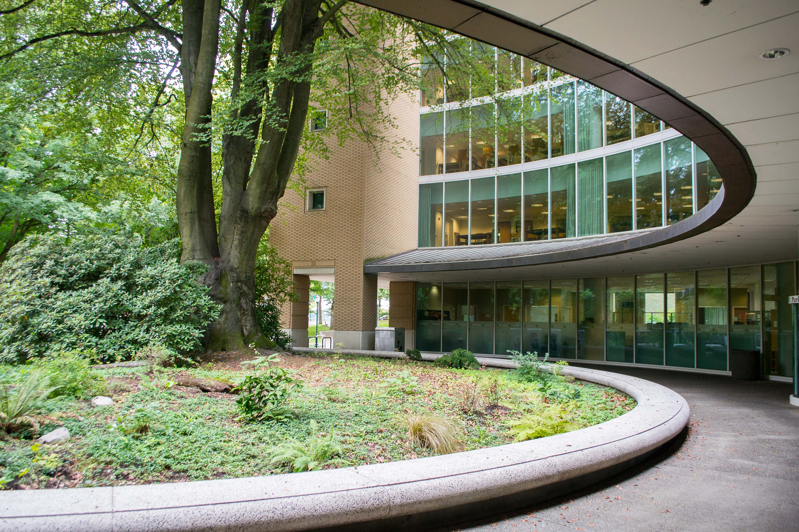

CS250 at CCUT Week 1: Introductions
======

Course Title: CS250 -- Discrete Structures I

Instructor: David Lu

Here's a reminder about me:
* Born and grew up in the US (mostly in New York, near New York city)
* Went to college at the [University at Buffalo](https://www.buffalo.edu/), which is located in upstate NY, near Canada.
* Graduated with a BA in Philosophy
* Graduated with an MPhil in Philosophy at [Syracuse University](https://www.syracuse.edu/) (also located in upstate NY - central), specializing in metaphysics and philosophical methodology
* Taught philosophy courses on ethics, metaphysics and epistemology, critical thinking, and formal logic at Syracuse University

Here are some pictures of SU:

The building housing the philosophy department:

* Now I teach discrete math, introduction to C++, and ethics for computing at Portland State University

* This is my 3rd year participating in the PSU--CCUT partnership program
* Oldest of three: one younger brother and one younger sister

### CS250 Purpose and Goals
CS 250 is the first term of the two term sequence CS 250-251. The main goal of the sequence is that students obtain those skills in discrete mathematics and logic that are used in the study and practice of computer science.

The goals of the course are listed below:
1. Describe basic properties of sets, bags, tuples, relations, graphs, trees, and functions.
1. Perform traversals of graphs and trees; construct simple functions by composition of known functions; determine whether simple functions are injective, surjective, or bijective; and classify simple functions by rate of growth.
1. Describe the concepts of countable and uncountable sets, and apply the diagonalization method to construct elements that are not in certain countable sets.
1. Construct inductive definitions for sets, construct grammars for languages (sets of strings), and construct recursive definitions for functions and procedures.
1. Construct a topological sort of a partially ordered set and determine whether a partially ordered set is well-founded.
1. Use elementary counting techniques to count simple finite structures that are either ordered or unordered, to count the worst case number of comparisons and, with discrete probability, to count the average number of comparisons for simple decision trees.
1. Find closed form solutions for simple recurrences using the techniques of substitution, cancellation, and generating functions.
1. Demonstrate standard proof techniques and the technique of inductive proof by writing short informal proofs about simple properties of numbers, sets, and ordered structures.

-------
