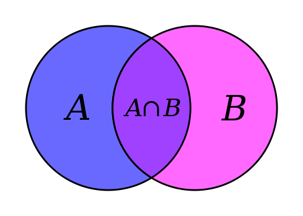

CS250 at CCUT Week 1: Introductions
======

Course Title: CS250 -- Discrete Structures I

Instructor: David Lu

Some facts about me:
* Born and grew up in the US (mostly in New York, near New York city)
* Went to college at the [University at Buffalo](https://www.buffalo.edu/), which is located in upstate NY, near Canada.
* Graduated with a BA in Philosophy
* Worked on a PhD in Philosophy at [Syracuse University](https://www.syracuse.edu/) (also located in upstate NY - central), specializing in metaphysics and philosophical methodology
* Taught philosophy courses on ethics, metaphysics and epistemology, critical thinking, and formal logic at Syracuse University

Here are some pictures of SU:

The building housing the philosophy department:

* Now I teach discrete math, introduction to C++, and ethics at Portland State University

Here are some pictures of PSU and Portland

PSU Library:

PSU location in downtown Portland:

Portland from the east side, looking west to downtown:

Portland steel bridge:

Mount Hood in the distance view from PSU:

Columbia River that separates Oregon state from Washington state:

Willamette River that separates east from west Portland:

Willamette River:

### CS250 Purpose and Goals
CS 250 is the first term of the two term sequence CS 250-251. The main goal of the sequence is that students obtain those skills in discrete mathematics and logic that are used in the study and practice of computer science.

The goals of the course are listed below:
1. Describe basic properties of sets, bags, tuples, relations, graphs, trees, and functions.
1. Perform traversals of graphs and trees; construct simple functions by composition of known functions; determine whether simple functions are injective, surjective, or bijective; and classify simple functions by rate of growth.
1. Describe the concepts of countable and uncountable sets, and apply the diagonalization method to construct elements that are not in certain countable sets.
1. Construct inductive definitions for sets, construct grammars for languages (sets of strings), and construct recursive definitions for functions and procedures.
1. Construct a topological sort of a partially ordered set and determine whether a partially ordered set is well-founded.
1. Use elementary counting techniques to count simple finite structures that are either ordered or unordered, to count the worst case number of comparisons and, with discrete probability, to count the average number of comparisons for simple decision trees.
1. Find closed form solutions for simple recurrences using the techniques of substitution, cancellation, and generating functions.
1. Demonstrate standard proof techniques and the technique of inductive proof by writing short informal proofs about simple properties of numbers, sets, and ordered structures.

-------

## Review of Basic Set Theory Ideas
You should have had an introduction to set theory by now. Let's do a little review before we take a look at our next topic.

Basic definitions for set theory.

**Definition 1**: A *set* is a well defined collection of objects, considered as an object itself. The objects making up the set are called *elements* or *members* of the set. There is no order to the elements and no multiplicity.

If *a* is an element of set *X*, then we write $a \in X$. And if not, we write $a \notin X$.

Sets are conventionally denoted with capital letters.

There is a set with no members, and it's called the *empty set*, denoted by $\emptyset$.

There are two ways of describing a set.

* The first is by extension, listing each member of the set. For example: $T = \{1, 2, 3, 4\}$

* The other is by intensional definition, using a rule or semantic description. For example: $S$ is the set containing the siblings of Richard. (Written $S = \{x$ : $x$ is a sibling of Richard$\}$)

We often have the choice of specifying a set either intensionally or extensionally. For example: $R = \{x $ : $x$ is one of the first four positive integers$\}$. So $T = R$. We use a pipe, '$\mid$', or sometimes a colon to read "such that." Here are some more examples:

* $S = \{x \mid$ x is a positive integer less than 100 $\}$
* $S = \{x \mid x \in \mathbb{Z}+$ and $x < 100\}$
* $S = \{x \in \mathbb{Z}+ \mid x < 100\}$
* A predicate can be used, e.g., $S = \{x \mid P(x)\}$ where $P(x)$ is true iff $x$ is a prime number.
* Positive rational numbers $\mathbb{Q}+ = \{x \in \mathbb{R} \mid \exists p, q \in \mathbb{Z}+ x = p/q\}$

Review:
* $S = \{a, b, c, d\}$.
* Order not important $S = \{a, b, c, d\} = \{b, c, a, d\}$.
* Each distinct object is either a member or not; listing more than once does not change the set. $S = \{a, b, c, d\} = \{a, b, c, b, c, d\}$.
* Dots “. . . ” may be used to describe a set without listing all of the members when the pattern is clear. $S = \{a, b, c, d, . . . , z\}$ or $S = \{5, 6, 7, . . . , 20\}$.
* Try not to overuse this. Patterns are not always as clear as the writer thinks.
* Sets can be elements of other sets, e.g.,
$\{\{1, 2, 3\}, a, \{u\}, \{b, c\}\}$
* The empty set is different from the set containing the empty set $\varnothing \neq \{\varnothing\}$

**Definition 2**: If $X$ and $Y$ are sets and have the same elements, then they are identical. (Extensionality) The identity of sets are given by their extensions (the elements they contain). This definition gives us a common proof strategy for proving set identities.

**Definition 3**: If every element of $X$ is an element of $Y$, then $X$ is a *subset* of $Y$. We write $X \subseteq Y$.

It follows from this definition that every set is a subset of itself.

Also, it's possible for a set to be an element of another set.

If $X \subseteq Y$ and $Y \not\subseteq X$ then $X \subset Y$. In other words, if every element of $X$ is an element of $Y$, but not every element of $Y$ is an element of $X$, then we say that $X$ is a *proper subset* of $Y$.

**Definition 4**: The set consisting of all subsets of $X$ is called the *power set* of $X$, written $\mathscr{P} (X)$

What are all the possible subsets of $\{a, b, c\}$?

**Definition 5**: The *union* of $X$ and $Y$, written $X \cup Y$, is the set of all things which are elements of $X$ or $Y$ or both.

$X \cup Y = \{x$ : $x \in X \lor x \in Y\}$

Venn diagrams can be useful to illustrate union and intersection.

**Definition 6**: The *intersection* of $X$ and $Y$, written $X \cap Y$, is the set of all things which are elements of both $X$ and $Y$.

**Definition 7**: If  $Z$ is a set of sets, then $\bigcup Z$ is the set of elements of elements of $Z$.
  $\bigcup Z = \{x$ : $x$ belongs to an element of $Z\}$ or
  $\bigcup Z = \{x$ : there is a $Y \in Z$ such that $x \in Y\}$

**Definition 8**: If  $Z$ is a set of sets, then $\bigcap Z$ is the set of objects which all elements of $Z$ have in common.
  $\bigcap Z = \{x$ : $x$ belongs to every element of $Z\}$ or
  $\bigcap Z = \{x$ : for all $Y \in Z$, $x \in Y\}$

**Definition 9** The *difference* $X \setminus Y$ is the set of all elements of $X$ which are not elements of $Y$.
$X \setminus Y = \{x$ : $x\in X$ and $x \notin Y\}$

### Important sets
$\mathbb{B}$ = Boolean values = $\{true, false\}$
$\mathbb{N}$ = natural numbers = $\{0, 1, 2, 3, . . . \}$
$\mathbb{Z}$ = integers = $\{. . . , -3, -2, -1, 0, 1, 2, 3, . . . \}$
$\mathbb{Z}+$ = $\mathbb{Z}\geq 1$ = positive integers = $\{1, 2, 3, . . . \}$
$\mathbb{R}$ = set of real numbers
$\mathbb{R}+$ = $\mathbb{R} > 0$ = set of positive real numbers
$\mathbb{C}$ = set of complex numbers
$\mathbb{Q}$ = set of rational numbers

#### Interval Notation
We can use interval notation to describe subsets of sets upon which an order is defined, e.g., numbers.
* $[a, b] = \{x \mid a \leq x \leq b\}$
* $[a, b) = \{x \mid a \leq x < b\}$
* $(a, b] = \{x \mid a < x \leq b\}$
* $(a, b) = \{x \mid a < x < b\}$
* closed interval $[a, b]$
* open interval $(a, b)$
* half-open intervals $[a, b)$ and $(a, b]$

#### Set Cardinality
>Definition:
If there are exactly $n$ distinct elements in a set $S$, where $n$ is a nonnegative integer, we say that $S$ is finite. Otherwise it is infinite.

>Definition
The cardinality of a finite set $S$, denoted by $|S|$, is the number of
(distinct) elements of $S$.

Examples:
* $|\varnothing| = 0$
* Let S be the set of letters of the English alphabet. Then $|S| = 26$.
* $|\{1, 2, 3\}| = 3$
* $|\{\varnothing\}| = 1$
* The set of integers $\mathbb{Z}$ is infinite.

#### Power Sets

>Definition
The set of all subsets of a set $S$ is called the power set of $S$.

* It is denoted by $\mathscr{P}(S)$.
* Formally: $\mathscr{P}(S) = \{S' \mid S' \subseteq S\}$
* In particular, $S \in \mathscr{P}(S)$ and $\varnothing \in \mathscr{P}(S)$.
* Example: $\mathscr{P}(\{a, b\}) = \{\varnothing, \{a\}, \{b\}, \{a, b\}\}$
* If $|S| = n$ then $|\mathscr{P}(S)| = 2^n$

#### Tuples
* The ordered $n$-tuple $(a_1, a_2, ... , a_n)$ is the ordered collection of $n$ elements, where $a_1$ is the first, $a_2$ the second, etc., and an the $n$-th (i.e., the last).
* Two $n$-tuples are equal iff their corresponding elements are equal.
$(a_1, a_2, ... , a_n) = (b_1, b_2, ... , b_n) \leftrightarrow a_1 = b_1 \land a_2 = b_2 \land ...  \land a_n = b_n$
* 2-tuples are called ordered pairs

## Ordered pairs, Tuples, and Cartesian Products

Sets have no order, but sometimes it is necessary to think of a collection in ordered terms. We use angle brackets to specify ordered pairs, such as $\langle x, y \rangle$. Order matters so $\langle x, y \rangle \neq \langle y, x \rangle$.

**Definition 10**: Given sets $X$ and $Y$, their *Cartesian product* $X \times Y = \{\langle x, y \rangle$ : $x \in X$ and $y \in Y\}$.

If $X = \{0, 1\}$ and $Y = \{1, a, b\}$ what is $X \times Y$?

**Theorem 1** If $X$ has $n$ elements and $Y$ has $m$ elements, then $X \times Y$ has $n \cdot m$ elements.

Why is this the case?

Proof

For every element $x$ in X, there are $m$ elements of the form $⟨x,y⟩∈X×Y$.
Let $Y_x = {⟨x,y⟩:y∈Y}$.
Since whenever $x_1 \neq 􏰁x_2, ⟨x_1,y⟩ \neq 􏰁 ⟨x_2,y⟩$, $Y_{x_1} \cap Y_{x_2} = ∅$.
But if $X = {x_1,...,x_n}$, then $X×Y=Y_{x_1} ∪···∪Y_{x_n}$, and so has $n·m$ elements.

To visualize this, arrange the elements of $X×Y$ in a grid:
$Y_{x_1} = \{⟨x_1,y_1⟩ ⟨x_1,y_2⟩ ... ⟨x_1,y_m⟩\}$
$Y_{x_2} = \{⟨x_2,y_1⟩ ⟨x_2,y_2⟩ ... ⟨x_2,y_m⟩\}$
...
$Y_{x_n} = \{⟨x_n,y_1⟩ ⟨x_n,y_2⟩ ... ⟨x_n,y_m⟩\}$

Since the $x_i$ are all different, and the $y_j$ are all different, no two of the pairs in this grid are the same, and there are $n · m$ of them.

**Russell's Paradox**
In a village, the barber shaves everyone who does not shave themselves, and no one else.

The question that prompts the paradox is this: Does the barber shave himself?

**Another Informal proof**:
If $X$ has $n$ elements then $\mathscr{P}(X)$ has $2^n$ elements.
Given an element $x$ of $S$, each subset of $S$ either includes $x$ or does not include $x$ (by definition of set), which gives us two possibilities.
The same reasoning holds for any element of $S$.
We can see that this means there are 2 * 2 * … * 2 = $2^{|S|}$ total possible combinations of elements of $S$.

----------

# Set Theory Exercises
1. Which of these sets are equal?
  {$x, y, z$}, {$z, y, z, x$}, {$y, x, y, z$}, {$y, z, x, y$}
<!--- They're all equal --->
 

2. List the elements of each set where $\mathbb{N}$ = {$1, 2, 3, ...$}.
  (a) $A =$ { $x \in \mathbb{N}$ | $3 < x < 9$}
  (b) $B =$ { $x \in \mathbb{N}$ | $x$ is even, $x < 11$}
<!---(a) The positive integers between 3 and 9. (b) The even positive integers less than 11. --->
 

3. Prove that $B \setminus A = B \cap \overline{A}$  
(The complement of a set $X$, $\overline{X}$  = {$x$ | $x \in \mathbb{U}$ and $x \notin X$})
<!--- Strategy B\A = {x|x \in B and x \notin A} is equal to {x|x \in B and x \in completment of A} which is to say B intersect complement A -->
 

4. Give some example sets that make the following statements true:
  (a) $A \cap B = A \cap C$ and $B \neq C$
  (b) $$D \cup E = D \cup F$ and $E = F$
  <!--- A = {1, 2}, B = {2, 3}, C = {2, 4}.
        D = {1, 2}, E = {1, 3}, F = {2, 3}--->
 

5. Prove that $A \cap (B \cup C) = (A \cap B) \cup (A \cap C)$  (Set distributivity law)
<!--- Strategy A \cap (B \cup C) = {x |x \in A and x \in (B \cup C), which is equivalent to {x|x \in A and x \in B, or x \in A and \x in C}
      That's to say, (A \cap B) \cup (A \cap C)  -->
 

6. Determine the validity of the following argument, using a Venn diagram:
  * All my friends are musicians.
  * Link is my friend.
  * None of my neighbors are musicians.
  Therefore Link is not my neighbor.
  <!-- Valid -->
 

7. Which of the following sets are identical?

$A = \{x | x^2 - 4x + 3 = 0\}$

$B = \{x | x^2 - 3x + 2 = 0\}$

$C = \{x | x \in \mathbb{N}, x < 3\}$

$D = \{x | x \in \mathbb{N}, x$ is odd, $x < 5\}$

$E = \{1, 2\}$

$F = \{1, 2, 1\}$

$G = \{3, 1\}$

$H = \{1, 1, 3\}$

<!-- B = C = E = F and A = D = G = H -->
 

8. Find the power set $\mathscr{P}(A)$ of $A = \{\{a, b\}, \{c\}, \{d, e, f\}\}$

<!--- A has 3 elements, so the powerset of A has 2^3=8 elements: $\{A | \{\{a, b\}, \{c\}\} | \{\{a, b\}, \{d, e, f\}\} | \{\{c\}, \{d, e, f\}\} | \{\{a, b\}\} | \{\{c\}\} | \{\{d, e, f\}\} | 0\}$ -->
 
