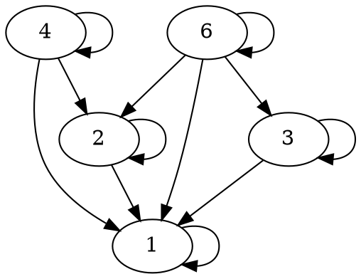

---
presentation:
  # The "normal" size of the presentation, aspect ratio will be preserved
  # when the presentation is scaled to fit different resolutions. Can be
  # specified using percentage units.
  width: 960
  height: 700
  transition: 'slide'
---

<!-- slide -->
$R = \{(1,1),(2,1),(2,2),(3,1),$
    $(3,3),(4,1),(4,2),(4,4),$
    $(6,1),(6,2),(6,3),(6,6)\}$

<!-- slide -->
Table:
|0 | 1 | 2 | 3 | 4 | 6 |
|---|---|---|---|---|---|---|
|1 |1 | 0 | 0 | 0 | 0|
|2 |1 | 1 | 0 | 0 | 0|
|3 |1 | 0 | 1 | 0 | 0|
|4 |1 | 1 | 0 | 1 | 0|
|6 |1 | 1 | 1 | 0 | 1|

<!-- slide -->

