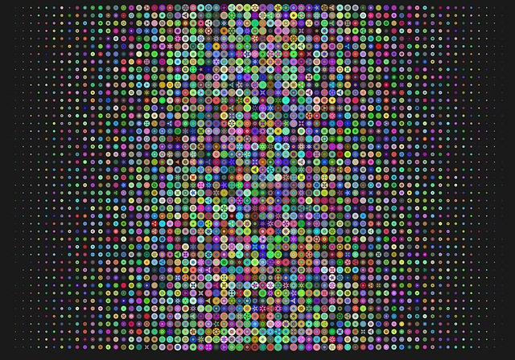

CS251 Week 1: Welcome!
=======

(Converted from week 1 slides)

Instructor: David Lu
Textbook: [A Concise Introduction to Logic](http://textbooks.opensuny.org/concise-introduction-to-logic/)
Author: Craig DeLancey

Another good textbook: [Forall x](https://www.fecundity.com/logic/)
Author: PD Magnus

#### About Your Instructor:
I'm glad to be back in Changchun and to see everyone here at CCUT again.

Some quick facts about me:
* Born and grew up in the US (mostly in New York)
* Went to college at the [University at Buffalo](https://www.buffalo.edu/), which is located in upstate NY, near Canada.
* Graduated with a BA in Philosophy
* Worked on a PhD in Philosophy at [Syracuse University](https://www.syracuse.edu/) (also located in upstate NY - central), specializing in metaphysics and philosophical methodology
* Taught philosophy courses over 6 years in ethics, metaphysics and epistemology, critical thinking, and formal logic at Syracuse University
* Currently teaching discrete math, introduction to C++, and ethics for computing at Portland State University
* 2nd year participating in the PSU/CCUT partnership program
* One younger brother and one younger sister

CS251 Guest Lectures at CCUT
-----

CS251 focuses on one central topic: Formal Logic

In this course, we will be studying a number of logical systems, also known
as logical theories or logical systems. Logic is important in all areas of study. It's not just for computer science students. Can you think of why?

#### Logical Systems

A logical system consists of four things:

1. A vocabulary of primitive signs used in the language of that system.
1. A list or set of rules governing what strings of signs (called *formulas*) are grammatically or syntactically well-formed in the language of that system.
1. A list of axioms, or a subset of the well-formed formulas, considered as basic and unprovable principles taken as true in the system.
1. A specification of what inferences, or inference patterns or rules, are taken as valid in that system.

#### The Languages
Because we always start discussing a logical system by discussing the
language it uses, it is worth pausing to discuss the notion of using language
to study language.

These comprise the first two parts of the logical system: a vocabulary and a syntax or grammar.

#### Metalanguage and Object Language

The languages of the systems we study are symbolic logical languages. They use symbols such as $\rightarrow$ and $\lor$, not found in ordinary English or Chinese.

However, we will talk and read *about* these logical languages in ordinary English or Chinese.

Whenever one language is used to discuss to study another, we can distinguish between the language that is being studied, called the **object language**, from the language in which we conduct the study, called the **metalanguage**.

What one is the object language and which one is the metalanguage for this course?

In this course, the object languages will be propositional logic (sometimes called sentential logic) and predicate calculus. In CS250, set theory was the main object language you studied.

Often we will use the metalanguage (English and Chinese) to prove things about the object language. Proving things already requires logical vocabulary! Fortunately English (and Chinese) has words like *all*, *or*, *and*, *if*, and so on. These are some of the logical vocabulary of English.

### The Propositional Logic

For the first part of this class, we will study the Propositional Logic (PL).

##### Logical Vocabulary

The Propositional Logic, like any  language contains a volcabulary. In this case, it is pretty small, so it is easy to study.

Logical Connectives: $\neg$, $\land$, $\lor$, $\rightarrow$, and $\equiv$ (sometimes $\leftrightarrow$)

Atomic Propositions: Uppercase letters: A, B, C, ... P, Q, R

Sentence Schema (sentence variables): lowercase letters: \textit{p, q, r}

Parentheses: ( ) [ ] \{ \}

##### Syntax

* Any atomic proposition, P, is syntactically well-formed.

* For any well-formed proposition, $p$, $\neg p$, is well-formed.

* For any well-formed propositions, $p$ and $r$, $p \land r$, $p \lor r$, $p \rightarrow r$, and $p \leftrightarrow r$ are well-formed.

#### Precision

Why do we study these logical languages?

**Answer:** We want to use them very precisely.

Consider the precision needed to program a computer.
Computers are very dumb. They do exactly what you tell them to.
Computer languages are very much like our logical languages - they are precise.

##### Vagueness
Natural languages like English and Chinese contain lots of imprecision.

Consider the sentence: *The train is moving too fast.*

Is this true or not?

##### Ambiguity

How about this one: *The professor from PSU is very nice.*

This one contains ambiguity and vagueness!

--------------------------------------------------------------
#### Exercises

Try some exercises from chapter 1 of the textbook

###### Exercise 1

Vagueness arises when the conditions under which a sentence might be true are not clear.

Come up with five sentences in English that are vague.

###### Exercise 2

Ambiguity arises when a word or phrase has several different meanings.

Come up with five sentences in English that are ambiguous.

Hint: This will require that you identify a homonym, two words that sound the same but have different meanings.

###### Exercise 3

We can often make a vague sentence precise by giving a specific interpretation for the vague term.

For each of the five vague sentences, try to come up with an interpretation that makes the sentence no longer vague.

###### Exercise 4

Again we can often make ambiguous sentences precise by specifying which meaning we intended for the ambiguous term.

For each of the five ambiguous sentences, make it precise.

###### Exercise 5

Come up with five examples of English sentences that are not declarative sentences.

----------------------------------
