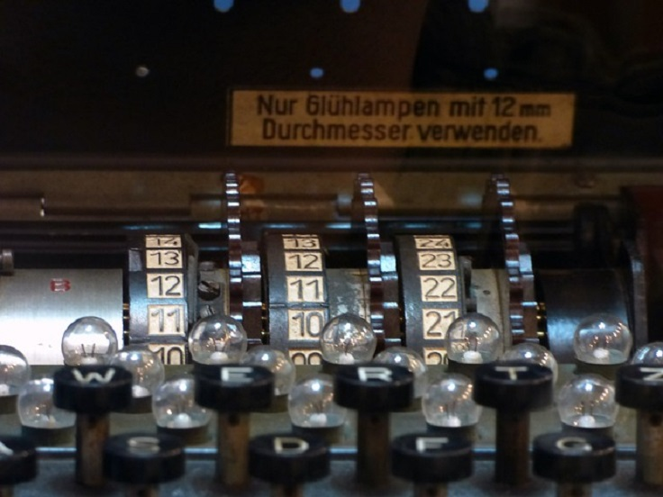

CS162: Homework #2 - Cipher
=======



From David Lu's Winter 2017 CS162 course.

Cipher Program
--------

>The  purpose  of  the  second  program  is  to  continue  refining  our  programming skills in C++ and practice using arrays of characters, the subscript operator, the `cstring`  library,  and functions  with  arguments.  Our  goal  is  to  create  programs where  `main()` delegates to  a  series  of small functions  that do the real  work.
>
>In this programming assignment, you are **not** allowed to use global variables. Avoid using break (unless  working  with  a  switch statement). Limit your functions to  less than 30 statements of code (not  including comments, blank lines, or variable definitions). You may not use a `return` in  the middle of a loop!

#### Program Assignment:
A cipher is an algorithm for encoding some  information so that people can’t immediately tell what it is without decoding it. For you second programming assignment, you will create a program that can take your name, PSU email address, and a key and, through a cipher that you  design, output the encoded results. Additionally, your program should, given an encoded name, PSU email addresses, and key, decode the information and output the result.

#### Cipher Details
Your cipher should generate a mapping for each plaintext character to a unique two digit number given a key which will also be a two digit number. You may disregard letter case, but you should consider what possible symbols may appear in an email address and encode them as well. (PSU email addresses can contain digits `0-9`, `@`, and `.`)

Your algorithm for generating this mapping must be deterministic. That is, given the same key, the encoding generated should be the same every time. This will allow your program to encode a message with a key and properly decode the encoding with the same key.

>You should consider how to generate unique two digit numbers for each character. That is, you should consider how to tell if a number generated has already been mapped to a character.
>
>You should also consider how to "wrap around" so you only generate two digit numbers.

#### Program details
Your mapping should be stored in an appropriately sized array of ints. For instance, if your array is called `cipherMap`, then perhaps `cipherMap[0]` is the two digit `int` that maps to the letter `a`, `cipherMap[25]` is the two digit `int` that maps to the letter `z`, and `cipherMap[26]` is the two digit `int` that maps to the digit `0`. You may or may not want to encode a space. It is up to you what conventions you pick for your mapping, but you must use an array.

The digits that characters map to must be generated by your cipher algorithm and key. They may not be hardcoded.

The mappings must be unique. That is, each character should map to a different two digit number.

Given different keys, your cipher algorithm should produce different mappings.

Ciphertext input shall be of the form `dd dd dd dd ...` where `d` is a digit.

#### Sample Execution

Encoding a name and email
```
> Menu:
(1) Encode a name and email
(2) Decode a name and email
> 1
> Enter a name:
> John Doe
> Enter an email:
> jdoe3@pdx.edu
> Enter a key:
> 42
> Encoded results:
> 81 24 54 13 55 75 24 83
> 81 75 83 21 33 61 79 75 94 10 83 75 15
```

Decoding a name and email
```
> Menu:
(1) Encode a name and email
(2) Decode a name and email
> 2
> Enter an encoded name:
> 81 24 54 13 55 75 24 83
> Enter an encoded email:
> 81 75 83 21 33 61 79 75 94 10 83 75 15
> Enter a key:
> 42
> Decoded results:
> john doe
> jdoe3@pdx.edu
```

(Note uppercase is not preserved after decoding.)
