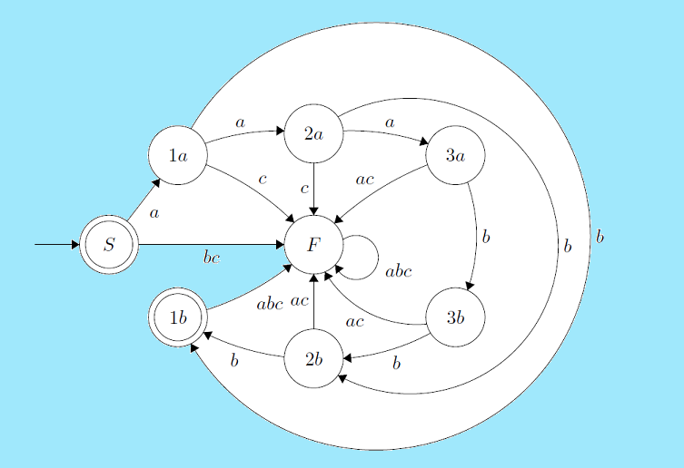

CS311: Homework #1 - DFA Analyzer
===========

From Professor Daniel Leblanc's Fall 2015 CS311 course: [External link](http://web.cecs.pdx.edu/~dleblanc/cs311/project1.pdf)

DFA Analyzer
----

### Overview
>The goal of this project is to write a program that will take a DFA and a string as input, and determine if the DFA will accept the provided string. You may use any programming language you find convenient.

The actual amount of code required for this project should be fairly small. I suggest taking this project as an opportunity to either learn a new programming language or use a language you haven’t used in a while.

Please note that you will be graded on your ability to solve the problem and the quality of your solution. Bad coding practices will result in a loss of points.

### 1 Encoding a DFA[20]
For the first part of this project you need to design a method for representing a DFA as a text file. The program you write later will need to read this file and be able to test strings against the DFA. Once you have designed a method you need to encode several DFAs that will later be used to test your program.

### 2 Reading the DFA[15]
Write a program that can take as input any text file encoded using the format you describe in step one. The program then needs to represent that DFA internally, in such a way that you will be able to check strings against the DFA. Your choice of programming language is likely to heavily influence the internal representation. Things like vectors and strings in C++ or libraries such as Java’s Hashmap are all perfectly acceptable for this assignment. If there is any doubt about a library you’d like to use, please contact me. You may assume that the text file is in the format you specify. Extensive error checking on the file contents is not required.

### 3 Processing a String[15]
Expand your program to take a string as input and test if the string is in the language recognized by the DFA. If the string contains symbols that are not elements of the Alphabet of the DFA, you may reject as soon as they are encountered.

### 4 Testing[20]
Thoroughly test your program with a wide variety of DFAs and inputs. There are a significant number of interesting corner cases that must be checked to get full credit. Make sure to perform your tests in such a way that the results can be included at the end of your writeup.

### 5 Writeup[30]
Your writeup should be one to two pages in length and should include a section describing your approach to each of the parts of the project. Be sure to describe any assumptions you made and any restrictions you placed on the DFAs and inputs. Also include explanations of why you made the design decisions you did and why your testing strategy is acceptable.
