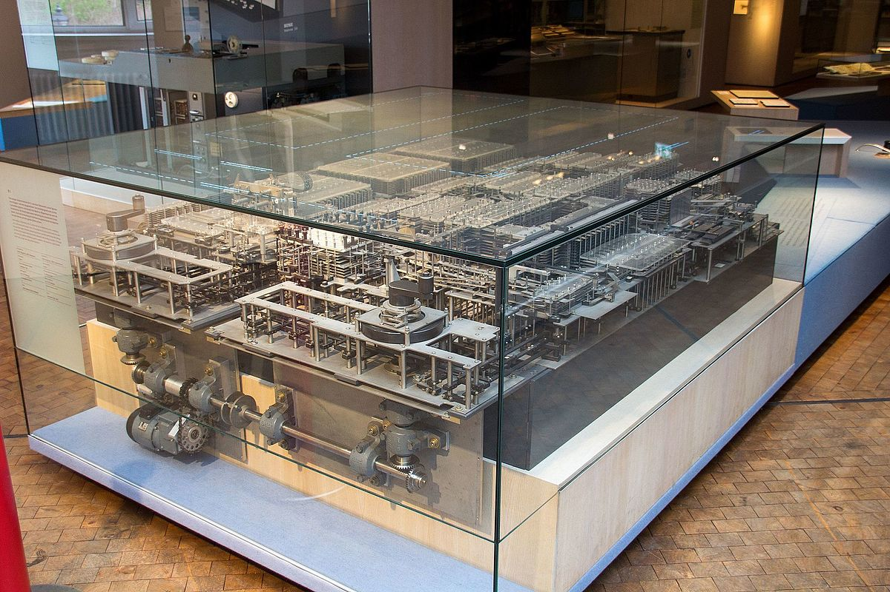
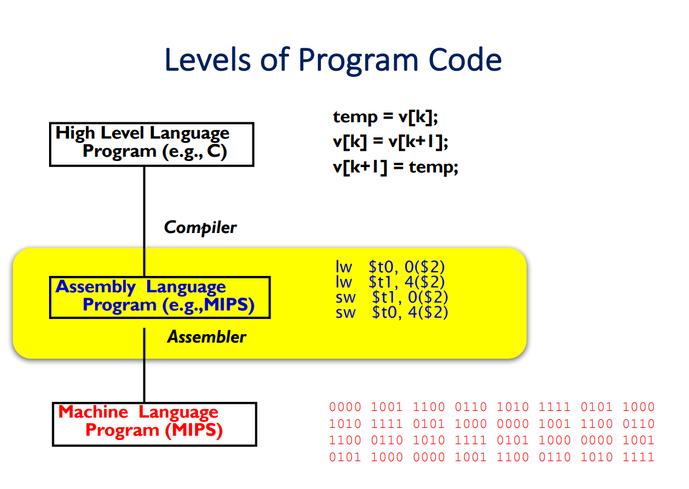

---
presentation:
  # The "normal" size of the presentation, aspect ratio will be preserved
  # when the presentation is scaled to fit different resolutions. Can be
  # specified using percentage units.
  width: 1280
  height: 740
  transition: 'slide'
---
<!-- slide -->
CS161 - Good Afternoon

<!-- slide data-background-video=Languages.mp4 data-background-video-loop=true data-background-video-muted-->

<!-- slide data-background-color=#000000 -->
## A brief history of Computing
(1820-1840s)
Charles Babbage came up with the idea for a mechanical computer
Ada Lovelace wrote the first computer program


<!-- slide data-background-color=#000000 -->
(1936)
Alan Turing invents the Turing Machine
He helps crack the German secret codes during World War II


<!-- slide data-background-color=#000000 -->
(late 1930s) Programmable mechanical computers like the Z1 here



<!-- slide data-background-color=#000000 -->
(1945) Computer architecture


<!-- slide data-background-color=#000000 -->

(late 1940s)

First digital computers like this Univac

<!-- slide -->
Digital computers only understand the language of binary digits, 0 and 1, called **machine code**.
(1940s Machine and Assembly; 1950s High Level Languages)
(Fortran: 1954)
(Lisp: 1958)
(COBOL: 1960)
<!-- slide data-background-color=#000000 -->



<!-- slide data-background-color=#000000 -->
(1973) C is invented by Ken Thompson and Dennis Ritchie and they write the Unix operating system in C


<!-- slide data-background-color=#000000 -->
(1985) C++ is invented by Bjarne Stroustrup


<!-- slide data-background-color=#000000 -->
(1991) Python is invented and is now one of the most widely used programming languages


<!-- slide -->
#Learn how to learn

<!-- slide -->
Don't learn how to code;
learn how to think

<!-- slide data-background-color=#000000 -->


<!-- slide data-background-color=#000000 -->


<!-- slide data-background-color=#000000  -->


<!-- slide data-background-color=#000000  -->


<!-- slide -->
### What is Computer Science?
- Problem solving: general strategies to solve any kind of problem.<!-- .element: class="fragment" data-fragment-index="1" -->

- Logic: methods for precise thinking<!-- .element: class="fragment" data-fragment-index="2" -->

- Data:  modeling information about the real world inside a computer<!-- .element: class="fragment" data-fragment-index="3" -->

- Systems: design and build complex systems that satisfy a set of requirements and constraints?<!-- .element: class="fragment" data-fragment-index="4" -->

- **Thinking**: artificial intelligence, machine learning, computer vision, and natural language processing are at the forefront of not only computer science, but also biology, psychology, philosophy, and mathematics.<!-- .element: class="fragment" data-fragment-index="5" -->

<!-- slide -->
Note that the previous list does not contain programming.

Programming is just a tool. But it is a very important tool to understand and be able to use early on in your computer science studies.

<!-- slide -->
Programming, or writing code, is how you instruct a computer to perform some actions.

<!-- slide -->


<!-- slide -->
All of programming is based on the principles of computer science we discussed above.

Logic, algorithms, data, systems engineering are used to build everything from the web browser that these slides are being presented in to the autopilot software on an airplane.

<!-- slide -->
Although programming involves lots of math and structure, it is also a very **creative** exercise

<!-- slide data-background-color=#000000 -->


<!-- slide -->
## CS161 Intro to Programming
* Languages
* Programming Tools
* Goals

<!-- slide data-background-color=#000000  -->


<!-- slide data-background-color=#000000  -->
Eclipse IDE


<!-- slide data-background-image=Ramsay.gif data-background-color=#000000 -->

<!-- slide -->
#What is the goal of CS161?

<!-- slide -->
## ... Learn to program without distraction

<!-- slide -->
#Mu
## https://codewith.mu/

<!-- slide data-background-color=#000000 -->


<!-- slide -->
## Live Demo
Bring your computers to class next time
(Try to install Mu: https://codewith.mu/)

Program idea: Write a python program that tells you whether a number is odd or even

<!-- slide -->
Review:

* Output
```py
print("Hello")
```

* Input
```py
x = input("Type something in\n")
print(x)
```

<!-- slide -->
* Variables
```py
x = 5
y = 6
z = x + y
print(z)
```

* Data Types
(int, float, str)

* Lists
```py
games = ['dota', 'starcraft', 'overwatch']
print(games)
```
