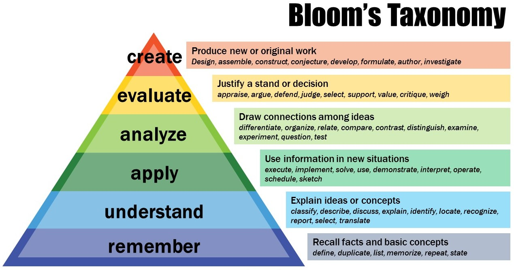
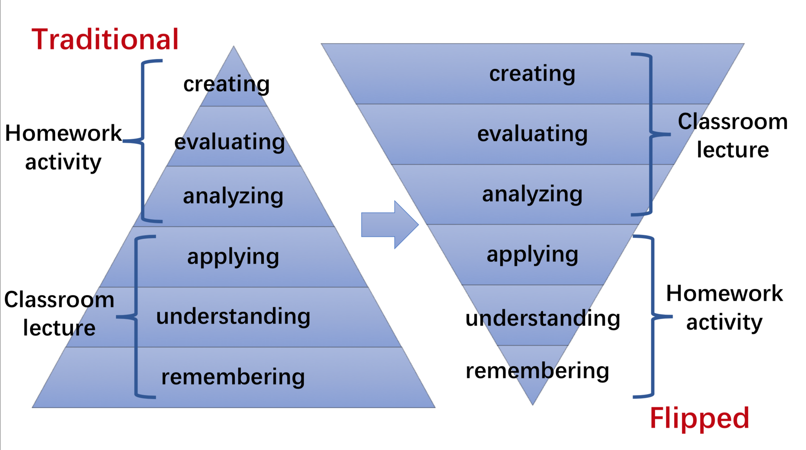
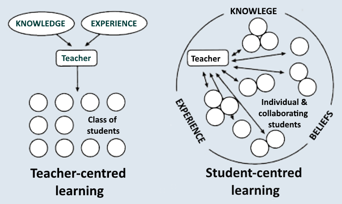
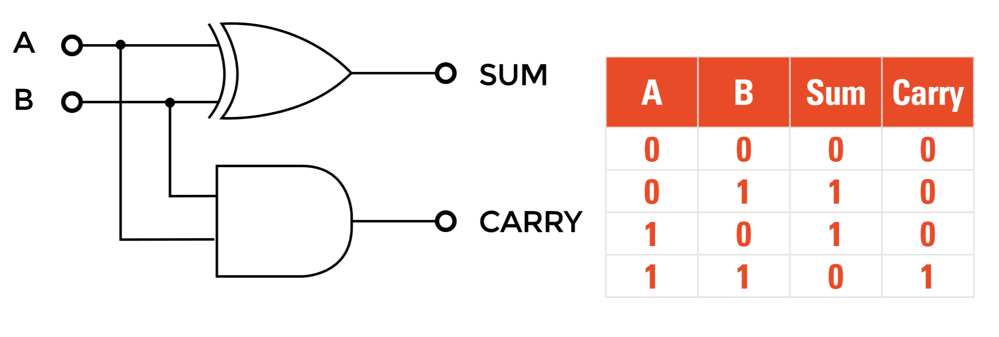

---
presentation:
  # The "normal" size of the presentation, aspect ratio will be preserved
  # when the presentation is scaled to fit different resolutions. Can be
  # specified using percentage units.
  width: 1280
  height: 740
  transition: 'slide'
---
<!-- slide -->
CS250 - Good Morning

<!-- slide data-background-video=Languages.mp4 data-background-video-loop=true data-background-video-muted-->

<!-- slide -->
## Learning to learn
Ideas on education in the US
<!-- slide -->

<!-- slide -->

<!-- slide -->

<!-- slide -->

<!-- slide -->
##Discussion
* What is education like in China?
* How do you learn?
* How would you make that better?
* What would make you pay attention in class?

<!-- slide -->
#BREAK!

<!-- slide -->
Today we are going to learn to count.

I'm Serious.

Don't worry, you already know how.

<!-- slide -->
We all know how to count.
$0, 1, 2, 3, 4, ...$

- But what happens after 9? <!-- .element: class="fragment" data-fragment-index="1" -->

- We come back around to 1.
$9+1 = 10$<!-- .element: class="fragment" data-fragment-index="2" -->
- This is the *base ten* counting system. <!-- .element: class="fragment" data-fragment-index="3" -->

<!-- slide -->
We've been doing this since we were little, but let's break a number down.

- $45667 = 4 * 10000 + 5 * 1000 + 6 * 100 + 6 * 10 + 7 * 1$
How else can I write this?

- $45667 = 4 * 10^4 + 5 * 10^3 + 6 * 10^2 + 6 * 10^1 + 7 * 10^0$
The value of the whole number is the value of each single digit and it's position<!-- .element: class="fragment" data-fragment-index="1" -->

<!-- slide -->
We can also count in other bases.

Here's base two.

- $0, 1, ...$
What comes next?

- Same as base ten, we come back to 1.
$0, 1, 10, 11, 100, 101, 110, 111, 1000, ...$ <!-- .element: class="fragment" data-fragment-index="1" -->

- This is the same as base ten, except we only have 2 digits: 0 and 1.
$1110 = 1 * 2^3 + 1 * 2^2 + 1 * 2^1 + 0 * 2^0 = 14$ <!-- .element: class="fragment" data-fragment-index="2" -->

- Try it yourself:
$1001=?$
$10101=?$
$100000000=?$<!-- .element: class="fragment" data-fragment-index="3" -->

<!-- slide -->
In fact, we can have any base we want.

In computer science, we almost always use bases 2, 8, 10, or 16. (Although 8 is somewhat rare)

<!-- slide -->
Base 16 is strange because we need to make up new digits for 10-15. We use the letters A-F for this and we often put a '0x' in front to signal that it's base 16.

$0xA22F = ?$

- $0xA22F = 10 * 16^3 + 2 * 16^2 + 2 * 16^1 + 15 * 16^0 = 41519$<!-- .element: class="fragment" data-fragment-index="1" -->

<!-- slide -->
- Base two counting is called binary
- Base eight counting is called octal
- Base ten counting is called decimal
- Base sixteen counting is called hexadecimal

<!-- slide -->

<!-- slide -->
For the rest of today, we're going to look at some basic logic

We talk about abstract, complex ideas in computer science. It would be good to break a statement down into its logical parts.

<!-- slide -->
When we work with math, we need to learn to break down a sentence into pieces.

**Example:** Let $g$ be a graph and $d$ a dominator of $c$ in $g$, for some nodes $d$ and $c$ of $g$. If $x \neq d$ is a node on a path from $d$ to $c$, then $d$ is a dominator of $x$.

Can you figure out what this is saying?

<!-- slide -->
Example: Let $g$ be a graph and $d$ a dominator of $c$ in $g$, for some nodes $d$ and $c$ of $g$. If $x \neq d$ is a node on a path from $d$ to $c$, then $d$ is a dominator of $x$.

* $g$ is a graph,
* $d$ is a dominator of $c$,
* $d$ and $c$ are in $g$,
* $x$ is in $g$,
* $x \neq d$,  
* and if $x$ is on a path from $d$ to $c$ then $d$ is a dominator of $x$.

<!-- slide -->
Some logic symbols

|Symbol | Meaning|
|-------|------|
|$\top$ | True |
|$\bot$ | False |
|$\neg a$ | not $a$|
|$a \land b$ | $a$ and $b$|
|$a \lor b$ | $a$ or $b$|
|$a \to b$ | if $a$ then $b$|

<!-- slide -->
If it’s raining and I’m using an umbrella, then I’m not from Portland.

- $a =$ It’s raining
- $b =$ I have an umbrella
- $c =$ I’m from Portland
- if $a$ and $b$, then not $c$.
-$(a \land b) \to \neg c$

<!-- slide -->
You can’t live in another country if you don’t have a passport and citizenship or a visa.

- $a =$ you have a passport
- $b =$ you have citizenship
- $c =$ you have a visa
- $d =$ you can live in another country
- if not $a$ and $b$ or $c$, then not $d$.
- $\neg(a \land (b \lor c)) \to \neg d$

<!-- slide -->
Be careful about how you group things together. These two are different sentences! Do they mean the same thing?

- $\neg(a \land (b \lor c)) \to \neg d$
- $\neg((a \land b) \lor c) \to \neg d$

The original sentence was **ambiguous**.

<!-- slide -->
The value of a logical formula is either $\top$ or $\bot$.
We find the value of a formula by assigning $\top$ or $\bot$ to all variables.

* Example:
if $a = \top$, $b = \bot$, and $c = \top$, then $(a \lor b) \land c = \top$.

<!-- slide -->
A truth table defines the way each logical symbol works:

| $a$ | $b$ | $a \land b$ |
|-----|----|----|
|$\top$ | $\top$ | $\top$|
|$\top$| $\bot$| $\bot$|
|$\bot$| $\top$| $\bot$|
|$\bot$|$\bot$|$\bot$|

What do you think the truth tables for $\neg$, $\lor$, and $\to$ look like?

<!-- slide -->
Is this what you found?

<!-- slide -->

<!-- slide -->

<!-- slide -->

<!-- slide -->

<!-- slide -->

<!-- slide -->

<!-- slide -->

<!-- slide -->
Why do you think it important to be able to break things down logically?

<!-- slide -->

<!-- slide -->

<!-- slide -->

<!-- slide -->

<!-- slide -->

<!-- slide -->
This is called a half adder

<!-- slide -->

<!-- slide -->
### Recap:
We learned
* to count in binary, octal, decimal, hexadecimal
* to break statements down in to logical parts
