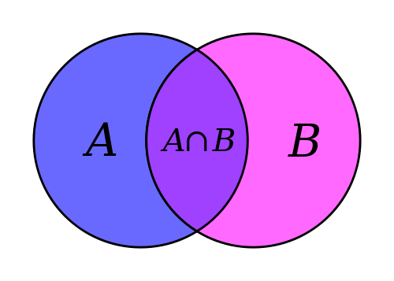

---
presentation:
  # The "normal" size of the presentation, aspect ratio will be preserved
  # when the presentation is scaled to fit different resolutions. Can be
  # specified using percentage units.
  width: 1280
  height: 740
  transition: 'slide'
---

<!-- slide -->
## Review of Basic Set Theory

<!-- slide -->
**Definition 1**: A *set* is a well defined collection of objects, considered as an object itself.

The objects making up the set are called *elements* or *members* of the set.

There is no order to the elements and no multiplicity.

<!-- slide -->
If *a* is an element of set *X*, then we write $a \in X$. And if not, we write $a \notin X$.

Sets are conventionally denoted with capital letters.

<!-- slide -->
There is a special set with no members, and it's called the *empty set*, denoted by $\emptyset$.

<!-- slide -->
There are two ways of describing a set.

* The first is by extension, listing each member of the set. For example: $T = \{1, 2, 3, 4\}$

* The other is by intensional definition, using a rule or semantic description. For example: $S$ is the set containing the siblings of Richard. (Written $S = \{x$ : $x$ is a sibling of Richard$\}$)

<!-- slide -->
We often have the choice of specifying a set either intensionally or extensionally. For example: $R = \{x $ : $x$ is one of the first four positive integers$\}$. So $T = R$. We use a pipe, '$\mid$', or sometimes a colon to read "such that."

<!-- slide -->
Examples:

* $S = \{x \mid$ x is a positive integer less than 100 $\}$
* $S = \{x \mid x \in \mathbb{Z}+$ and $x < 100\}$
* $S = \{x \in \mathbb{Z}+ \mid x < 100\}$
* A predicate can be used, e.g., $S = \{x \mid P(x)\}$ where $P(x)$ is true iff $x$ is a prime number.
* Positive rational numbers $\mathbb{Q}+ = \{x \in \mathbb{R} \mid \exists p, q \in \mathbb{Z}+ x = p/q\}$

<!-- slide -->
**Definition 2**: If $X$ and $Y$ are sets and have the same elements, then they are identical. (Extensionality) The identity of sets are given by their extensions (the elements they contain). This definition gives us a common proof strategy for proving set identities.

<!-- slide -->
**Definition 3**: If every element of $X$ is an element of $Y$, then $X$ is a *subset* of $Y$. We write $X \subseteq Y$.

It follows from this definition that every set is a subset of itself.

Also, it's possible for a set to be an element of another set.

If $X \subseteq Y$ and $Y \not\subseteq X$ then $X \subset Y$. In other words, if every element of $X$ is an element of $Y$, but not every element of $Y$ is an element of $X$, then we say that $X$ is a *proper subset* of $Y$.

<!-- slide -->
**Definition 4**: The set consisting of all subsets of $X$ is called the *power set* of $X$, written $\mathscr{P} (X)$

What are all the possible subsets of $\{a, b, c\}$?

<!-- slide -->
**Definition 5**: The *union* of $X$ and $Y$, written $X \cup Y$, is the set of all things which are elements of $X$ or $Y$ or both.

$X \cup Y = \{x$ : $x \in X \lor x \in Y\}$

Venn diagrams can be useful to illustrate union and intersection.

<!-- slide -->
**Definition 6**: The *intersection* of $X$ and $Y$, written $X \cap Y$, is the set of all things which are elements of both $X$ and $Y$.

<!-- slide -->
**Definition 7** The *difference* $X \setminus Y$ is the set of all elements of $X$ which are not elements of $Y$.

$X \setminus Y$ (also written $X - Y$) $= \{x$ : $x\in X$ and $x \notin Y\}$

<!-- slide -->
### Important sets
$\mathbb{B}$ = Boolean values = $\{true, false\}$
$\mathbb{N}$ = natural numbers = $\{0, 1, 2, 3, . . . \}$
$\mathbb{Z}$ = integers = $\{. . . , -3, -2, -1, 0, 1, 2, 3, . . . \}$
$\mathbb{Z}+$ = $\mathbb{Z}\geq 1$ = positive integers = $\{1, 2, 3, . . . \}$
$\mathbb{R}$ = set of real numbers
$\mathbb{R}+$ = $\mathbb{R} > 0$ = set of positive real numbers
$\mathbb{C}$ = set of complex numbers
$\mathbb{Q}$ = set of rational numbers

<!-- slide -->
#### Set Cardinality
>Definition:
If there are exactly $n$ distinct elements in a set $S$, where $n$ is a nonnegative integer, we say that $S$ is finite. Otherwise it is infinite.

>Definition
The cardinality of a finite set $S$, denoted by $|S|$, is the number of
(distinct) elements of $S$.

<!-- slide -->
Examples:
* $|\varnothing| = 0$
* Let S be the set of letters of the English alphabet. Then $|S| = 26$.
* $|\{1, 2, 3\}| = 3$
* $|\{\varnothing\}| = 1$
* The set of integers $\mathbb{Z}$ is infinite.

<!-- slide -->
#### Power Sets

>Definition
The set of all subsets of a set $S$ is called the power set of $S$.

* It is denoted by $\mathscr{P}(S)$.
* Formally: $\mathscr{P}(S) = \{S' \mid S' \subseteq S\}$
* In particular, $S \in \mathscr{P}(S)$ and $\varnothing \in \mathscr{P}(S)$.
* Example: $\mathscr{P}(\{a, b\}) = \{\varnothing, \{a\}, \{b\}, \{a, b\}\}$
* If $|S| = n$ then $|\mathscr{P}(S)| = 2^n$

<!-- slide -->
Sets have no order, but sometimes it is useful to think of a collection in ordered terms. We use angle brackets to specify ordered pairs, such as $\langle x, y \rangle$. Order matters so $\langle x, y \rangle \neq \langle y, x \rangle$.
<!-- slide -->

#### Tuples
* The ordered $n$-tuple $\langle a_1, a_2, ... , a_n \rangle$ is the ordered collection of $n$ elements, where $a_1$ is the first, $a_2$ the second, etc., and an the $n$-th (i.e., the last).
* Two $n$-tuples are equal iff their corresponding elements are equal.
$\langle a_1, a_2, ... , a_n\rangle = \langle b_1, b_2, ... , b_n\rangle \leftrightarrow a_1 = b_1 \land a_2 = b_2 \land ...  \land a_n = b_n$
* 2-tuples are called ordered pairs

<!-- slide -->
**Definition 8**:
Given sets $X$ and $Y$, their *Cartesian product* $X \times Y = \{\langle x, y \rangle$ : $x \in X$ and $y \in Y\}$.

If $X = \{0, 1\}$ and $Y = \{1, a, b\}$ what is $X \times Y$?

<!-- slide -->
**Theorem 1** If $X$ has $n$ elements and $Y$ has $m$ elements, then $X \times Y$ has $n \cdot m$ elements.

Why is this the case?

<!-- slide -->
Proof:

For every element $x$ in $X$, there are $m$ elements of the form $⟨x,y⟩∈X×Y$.
Let $Y_x = {⟨x,y⟩:y∈Y}$.
Since whenever $x_1 \neq x_2, ⟨x_1,y⟩ \neq ⟨x_2,y⟩$, $Y_{x_1} \cap Y_{x_2} = ∅$.
But if $X = {x_1,...,x_n}$, then $X×Y=Y_{x_1} ∪···∪Y_{x_n}$, and so has $n·m$ elements.

<!-- slide -->

To visualize this, arrange the elements of $X×Y$ in a grid:
$Y_{x_1} = \{⟨x_1,y_1⟩ ⟨x_1,y_2⟩ ... ⟨x_1,y_m⟩\}$
$Y_{x_2} = \{⟨x_2,y_1⟩ ⟨x_2,y_2⟩ ... ⟨x_2,y_m⟩\}$
...
$Y_{x_n} = \{⟨x_n,y_1⟩ ⟨x_n,y_2⟩ ... ⟨x_n,y_m⟩\}$

Since the $x_i$ are all different, and the $y_j$ are all different, no two of the pairs in this grid are the same, and there are $n · m$ of them.

<!-- slide -->
If $X$ has $n$ elements then $\mathscr{P}(X)$ has $2^n$ elements.

What's the proof?

<!-- slide -->
Given an element $x$ of $S$, each subset of $S$ either includes $x$ or does not include $x$ (by definition of set), which gives us two possibilities.

The same reasoning holds for any element of $S$.

We can see that this means there are 2 * 2 * … * 2 = $2^{|S|}$ total possible combinations of elements of $S$.

<!-- slide -->
Here are some problems to try:
1. Which of these sets are equal?
  {$x, y, z$}, {$z, y, z, x$}, {$y, x, y, z$}, {$y, z, x, y$}

2. List the elements of each set where $\mathbb{N}$ = {$1, 2, 3, ...$}.
(a) $A =$ { $x \in \mathbb{N}$ | $3 < x < 9$}
(b) $B =$ { $x \in \mathbb{N}$ | $x$ is even, $x < 11$}

3. Prove that $B \setminus A = B \cap \overline{A}$  
(The complement of a set $X$, $\overline{X}$  = {$x$ | $x \in \mathbb{U}$ and $x \notin X$})

4. Prove that $A \cap (B \cup C) = (A \cap B) \cup (A \cap C)$  (Set distributivity law)

<!-- slide -->
Why is it important to learn about sets?

We build many other ideas from sets and use them to solve problems mathematically, such as relations, functions, graphs, spaces, etc...

Set theory is **foundational** to mathematics and computer science.

<!-- slide -->

### Binary relations:

If $A = \{1, 2\}$ and $B = \{a, b, c\}$, then:

$A \times B = \{\langle 1, a \rangle, \langle 1, b \rangle, \langle 1, c \rangle, \langle 2, a \rangle, \langle 2, b \rangle, \langle 2, c \rangle\}$
 

A *binary relation* $R$ from $A$ to $B$ is a subset of $A \times B$
If $\langle a, b \rangle \in R$, then we can write $Rab$ or $aRb$.

The *inverse relation* $R^{-1}$ is the relation from $B$ to $A$ which consists of the ordered pairs, which, when reversed, belong to $R$. $R^{-1} = \{\langle b, a \rangle | \langle a, b \rangle \in R\}$

<!-- slide -->
#### Relations and graphs

Relations can be depicted by graphs. Draw a graph for the following relation $R$.
$R = \{\langle 1, 2 \rangle, \langle 2, 2 \rangle, \langle 2, 4 \rangle, \langle 3, 2 \rangle, \langle 3, 4 \rangle, \langle 4, 1\rangle, \langle 4, 3 \rangle \}$

What does the inverse $R^{-1}$ look like?

<!-- slide -->
#### Relations and tables

Relations can also be represented as a table or two dimensional array. What would that look like? Construct one for $R = \{\langle 1, 2 \rangle, \langle 2, 2 \rangle, \langle 2, 4 \rangle, \langle 3, 2 \rangle, \langle 3, 4 \rangle, \langle 4, 1\rangle, \langle 4, 3 \rangle \}$.

<!-- slide -->

#### Relation Composition or product

Suppose that we have three sets $A$, $B$, and $C$, a relation $R$ defined from $A$ to $B$, and a relation $S$ defined from $B$ to $C$. We can define a composition of $R$ and $S$, written $(R | S)$ (but sometimes $S \circ R$), as follows. If $a$ is an element of $A$ and $c$ is an element of $C$, then $(R | S)ac$ iff there exists some element $b$ in $B$ such that $Rab$ and $Sbc$. So we have a relation $R|S$ from $a$ to $c$ iff $a$ is $R$ related to $b$ and $b$ is $S$ related to $c$.

<!-- slide -->
Let $A$ = {1, 2, 3, 4}, $R$ = {(1, 2), (1, 2), (2, 4), (3, 2)}
and $S$ = {(1, 4), (1, 3), (2, 3), (3, 1), (4, 1)}
Find $R|S$.

<!-- slide -->
#### Relation Properties
Relations have many interesting properties. Some that we're interested in include: reflexivity, symmetry, antisymmetry, transitivity, equivalence, and partial and total order.

We will take a look at them next time.
