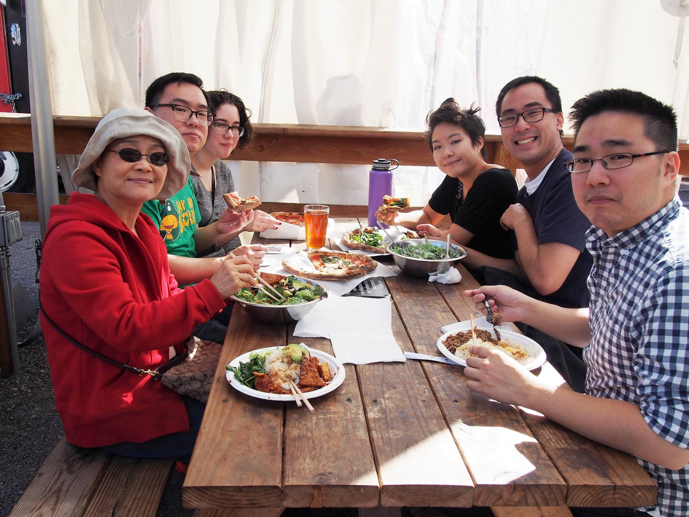
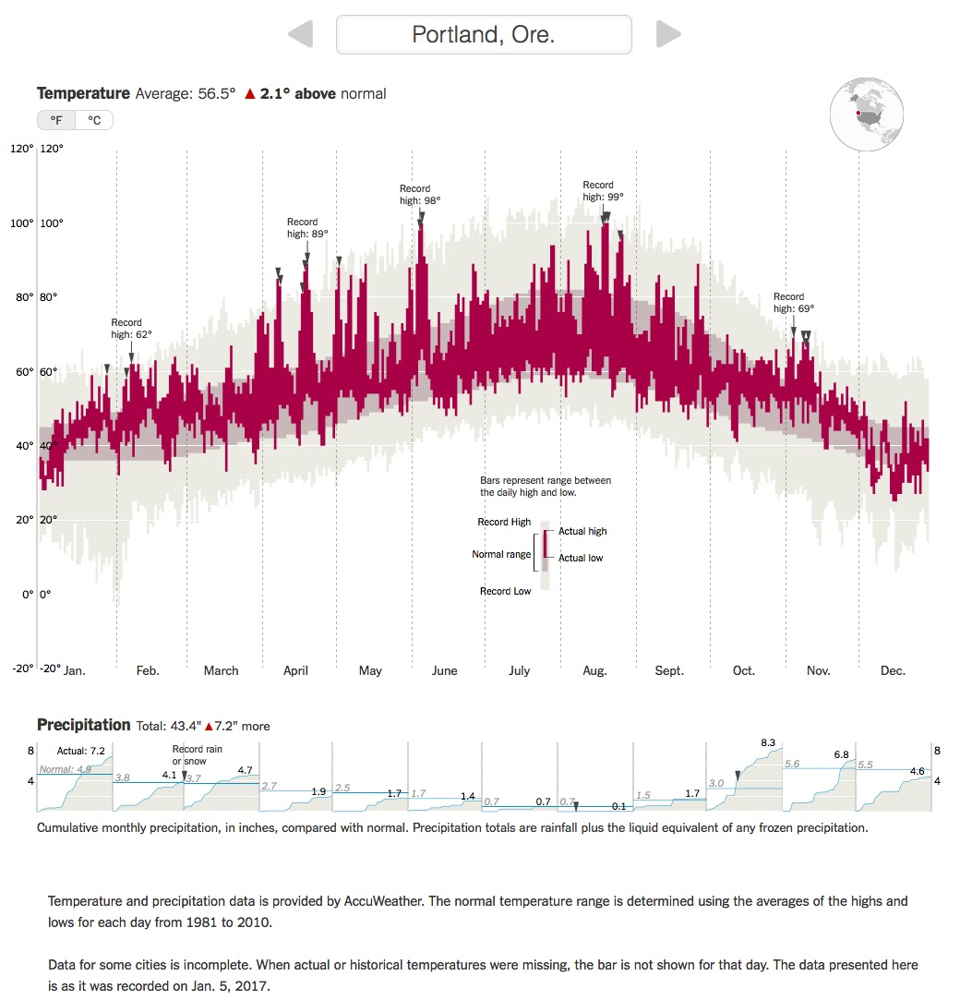

---
presentation:
  # The "normal" size of the presentation, aspect ratio will be preserved
  # when the presentation is scaled to fit different resolutions. Can be
  # specified using percentage units.
  width: 1280
  height: 740
  transition: 'slide'
---

<!-- slide -->
##Fall 2019 PSU$-$Changchun Partnership
###$\bowtie$
###David Lu

<!-- slide -->
#Welcome

<!-- slide data-background-color=#000000 -->
Ragnar and Luna

<!-- slide data-background-image="NY.jpg" -->
<!-- slide data-background-image="USA.jpg"-->

<!-- slide data-background-image="SUFall.jpg" -->
<!-- slide data-background-color=#000000 -->

<!-- slide -->
6 years ago I moved...

<!-- slide data-background-image="Portland2.jpg" -->
<!-- slide data-background-image="Portland.jpg" -->
<!-- slide data-background-image="PdxFall18.jpg" -->
<!-- slide data-background-color=#000000 -->

<!-- slide data-background-image="MtHood.jpg" -->
<!-- slide data-background-image="Willamette.jpg" -->
<!-- slide data-background-image="StreetCar2.jpg" -->

<!-- slide -->
How did I end up here?
- Self Learning
<!-- .element: class="fragment" data-fragment-index="1" -->

<!-- slide data-background-color=#000000 -->

<!-- slide data-background-color=#000000 -->
My other job: cybersecurity research

<!-- slide data-background-image="PSULogo.jpg" -->
<!-- slide data-background-image="PSUiso.jpg" -->
<!-- slide data-background-image="PSU.jpg" -->
<!-- slide data-background-image="KarlMiller.jpg" -->
<!-- slide data-background-image="KarlMillerInside.jpg" -->
<!-- slide data-background-image="StreetCar.jpg" -->
<!-- slide -->
PSU Dorms $\to$

<!-- slide -->
Some of my favorite places around Portland
<!-- slide data-background-image="Lillard.jpg" -->
<!-- slide data-background-image="FarmersMarket.jpg" -->
<!-- slide data-background-image="FoodCarts.jpg" -->
<!-- slide data-background-image="Heart.jpg" -->
<!-- slide data-background-image="23rd.jpeg" -->
<!-- slide data-background-image="Hawthorne.jpg" -->
<!-- slide data-background-image="Alberta.jpg" -->
<!-- slide data-background-image="Park.jpg" -->
<!-- slide data-background-image="DragonBoat.jpg" -->
<!-- slide data-background-image="LanSu.jpg" -->
<!-- slide data-background-image="Hike.jpg" -->
<!-- slide data-background-image="Hood.jpg" -->
<!-- slide data-background-image="Falls.jpg" -->

<!-- slide -->
I'm happy to answer any questions!
