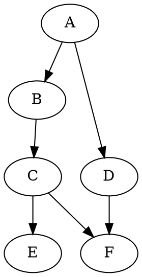

---
presentation:
  # The "normal" size of the presentation, aspect ratio will be preserved
  # when the presentation is scaled to fit different resolutions. Can be
  # specified using percentage units.
  width: 1280
  height: 740
  transition: 'slide'
  theme: "sky.css"
---

<!-- slide -->
# An example reveal.js slide deck

<!-- slide -->
### Markdown Basics
`All` ~the~ *regular* **markdown** ~~stuffs~~ ^work^

<!-- slide -->
Fragments also work:

- And here's a third one <!-- .element: class="fragment" data-fragment-index="3" -->
- Here's the first one <!-- .element: class="fragment" data-fragment-index="1" -->
- Here's a second one <!-- .element: class="fragment" data-fragment-index="2" -->

<!-- slide -->
Here's a markdown table

First Header | Second Header
|------------ | -------------|
Content from cell 1 | Content from cell 2
Content in the first column | Content in the second column

<!-- slide -->
Images are easy


<!-- slide -->
Here's a code block with syntax highlighting:
```py {.line-numbers}
thislist = ["apple", "banana", "cherry"]
if "apple" in thislist:
  print("Yes, 'apple' is in the list")
```
<!-- slide -->
Math rendering is powered by LaTeX
$L' = {L}{\sqrt{1-\frac{v^2}{c^2}}}$

$(A \land B) \to (C \lor \neg D)$

<!-- slide -->
Next is a video in the background with sound

<!-- slide data-background-video=Languages.mp4 data-background-video-loop=true -->

<!-- slide -->
Flow charts are powered by [flowchart.js](http://flowchart.js.org/)
```flow  
st=>start: Start:>http://www.google.com[blank]
e=>end:>http://www.google.com
op1=>operation: My Operation
sub1=>subroutine: My Subroutine
cond=>condition: Yes
or No?:>http://www.google.com
io=>inputoutput: catch something...
para=>parallel: parallel tasks

st->op1->cond
cond(yes)->io->e
cond(no)->para
para(path1, bottom)->sub1(right)->op1
para(path2, top)->op1
```

<!-- slide -->
Sequence diagrams are powered by [js-sequence-diagrams](https://bramp.github.io/js-sequence-diagrams/).
```sequence {theme="hand"}
Title: Here is a title
A->B: Normal line
B-->C: Dashed line
C->>D: Open arrow
D-->>A: Dashed open arrow
note right of C: This is to\nthe right of C
```

<!-- slide -->
Graph rendering with [vis.js](https://github.com/mdaines/viz.js)



<!-- slide -->

[Vega](https://vega.github.io/vega/) and [vega-lite](https://vega.github.io/vega-lite/) are supported
```vega-lite
{
  "$schema": "https://vega.github.io/schema/vega-lite/v4.json",
  "description": "Log-scaled Histogram.  We may improve the support of this. See https://github.com/vega/vega-lite/issues/4792.",
  "data": {
    "values": [
      {"x": 0.01},
      {"x": 0.1},
      {"x": 1},
      {"x": 1},
      {"x": 1},
      {"x": 1},
      {"x": 10},
      {"x": 10},
      {"x": 100},
      {"x": 500},
      {"x": 800}
    ]
  },
  "transform": [{
      "calculate": "log(datum.x)/log(10)", "as": "log_x"
  }, {
      "bin": true,
      "field": "log_x",
      "as": "bin_log_x"
  }, {
    "calculate": "pow(10, datum.bin_log_x)", "as": "x1"
  }, {
    "calculate": "pow(10, datum.bin_log_x_end)", "as": "x2"
  }],
  "mark": "bar",
  "encoding": {
    "x": {
      "field": "x1",
      "type": "quantitative",
      "scale": {"type": "log", "base": 10},
      "axis": {"tickCount": 5}
    },
    "x2": {
      "field": "x2"
    },
    "y": {
      "aggregate": "count",
      "type": "quantitative"
    }
  }
}
```
